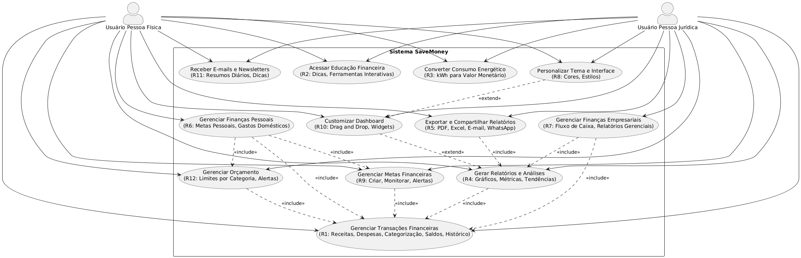

### Personas

#### Persona 1: João, o Estudante Organizado

* **Informações:** João tem 25 anos, mora em São Paulo (SP) e é estudante universitário de Engenharia de Software. Ele trabalha como estagiário em uma startup de tecnologia e tem uma renda mensal limitada.
* **Objetivos:** Seu principal objetivo é organizar suas despesas mensais (aluguel, transporte, alimentação e lazer) para conseguir economizar uma parte do seu salário. Ele sonha em fazer um intercâmbio no próximo ano e precisa saber exatamente para onde seu dinheiro está indo.
* **Dores e Desafios:** João já tentou usar planilhas, mas acha o processo demorado e acaba esquecendo de preencher. Ele se sente frustrado por não ter uma visão clara de seus "ralos de dinheiro" e tem dificuldade em criar um orçamento que consiga seguir. A falta de disciplina para o registro manual é seu maior obstáculo.
* **Como o Save Money V2 Ajuda:**
    * João pode usar o Controle Financeiro (R1) para registrar rapidamente suas despesas pelo celular, categorizando cada uma.
    * Com a Gestão de Orçamento (R12), ele define limites para categorias como "lazer" e recebe alertas antes de estourar o orçamento.
    * O Dashboard Personalizado (R10) permite que ele veja, de forma visual e rápida, seus principais gastos do mês.
    * O módulo de Educação Financeira (R2) oferece dicas práticas sobre como criar uma reserva de emergência, algo que ele ainda não sabe como fazer.

#### Persona 2: Maria, a Empreendedora Eficiente

* **Informações:** Maria tem 40 anos, é casada, tem dois filhos e é dona de uma pequena cafeteria em Curitiba (PR). Ela é apaixonada pelo seu negócio, mas se sente sobrecarregada com a parte administrativa e financeira.
* **Objetivos:** O principal objetivo de Maria é ter um controle simplificado do fluxo de caixa da sua empresa para tomar decisões mais rápidas, como quando investir em um novo equipamento ou contratar um funcionário. Ela precisa de relatórios claros para apresentar ao seu contador e, eventualmente, a um gerente de banco para solicitar um empréstimo.
* **Dores e Desafios:** A maior dor de Maria é a falta de tempo. Ela passa o dia gerenciando a operação da cafeteria e, à noite, tenta organizar as finanças em uma planilha complexa, o que a deixa exausta e propensa a erros. Ela considera os softwares de gestão financeira do mercado muito caros e complexos para a sua necessidade.
* **Como o Save Money V2 Ajuda:**
    * Maria utiliza o Perfil Pessoa Jurídica (R7) para separar as finanças da cafeteria das suas contas pessoais.
    * A funcionalidade de Relatórios, Diagnósticos e Resultados (R4) gera automaticamente um relatório de fluxo de caixa mensal. Com um clique, ela usa a Exportação (R5) para enviar o PDF para seu contador.
    * Os diagnósticos inteligentes a alertam: "Notamos que seus gastos com fornecedores de grãos de café aumentaram 15% este mês", ajudando-a a renegociar preços.
    * O Conversor de Energia (R3) a ajuda a entender o impacto da conta de luz no custo operacional, incentivando-a a trocar equipamentos por modelos mais eficientes.

### Histórias de Usuários

| EU COMO... [QUEM] | ...QUERO/DESEJO... [O QUE] | ...PARA... [PORQUÊ] |
| :--- | :--- | :--- |
| João (Estudante) | Cadastrar minhas despesas de forma rápida pelo celular | Ter um controle financeiro eficiente e saber onde posso economizar para meu intercâmbio. |
| Maria (Empresária) | Gerar relatórios de fluxo de caixa em PDF | Apresentar os resultados do meu negócio de forma profissional para meu contador. |
| João (Estudante) | Criar uma meta de economia para minha viagem | Acompanhar meu progresso de forma visual e me manter motivado. |
| Maria (Empresária) | Receber um resumo diário das finanças por e-mail | Me manter atualizada sobre a saúde financeira do meu negócio sem precisar abrir o sistema todo dia. |

### Requisitos do Projeto

#### Requisitos Funcionais

| ID | Descrição | Prioridade |
| :--- | :--- | :--- |
| R1 | **Controle Financeiro:** Permitir o gerenciamento completo de finanças, incluindo registro de receitas/despesas, categorização, visualização de saldos e histórico. | Alta |
| R2 | **Educação Financeira:** Disponibilizar conteúdos educativos (artigos, dicas, newsletters) e ferramentas interativas para auxiliar no planejamento financeiro. | Média |
| R3 | **Conversor de Energia:** Fornecer um conversor para transformar consumo energético (kWh) em valores monetários, considerando as bandeiras tarifárias via API. | Baixa |
| R4 | **Relatórios, Diagnósticos e Resultados:** Gerar relatórios detalhados com gráficos interativos, métricas, análises de tendências e projeções futuras. | Alta |
| R5 | **Exportação e Compartilhamento:** Permitir que relatórios sejam exportados em PDF e Excel e compartilhados via e-mail ou WhatsApp. | Alta |
| R6 | **Perfil Pessoa Física:** Disponibilizar funcionalidades específicas para usuários individuais, como metas financeiras pessoais e controle de gastos domésticos. | Alta |
| R7 | **Perfil Pessoa Jurídica:** Oferecer recursos para empresas, como gestão de fluxo de caixa, controle de despesas operacionais e relatórios gerenciais (DRE simplificado). | Alta |
| R8 | **Personalização do Tema:** Permitir ao usuário escolher temas, esquemas de cores e estilos de interface. | Média |
| R9 | **Metas Financeiras:** Oferecer a possibilidade de criar, monitorar e gerenciar metas financeiras, com alertas de progresso e indicadores visuais. | Alta |
| R10 | **Dashboard Personalizado:** Permitir ao usuário customizar seu painel financeiro com widgets configuráveis e função *drag and drop*. | Alta |
| R11 | **E-mails Diários e Newsletters:** Enviar resumos diários, dicas financeiras e notificações importantes por e-mail. | Média |
| R12 | **Gestão de Orçamento:** Permitir o planejamento e controle de orçamentos, com definição de limites por categoria e alertas ao atingir os valores definidos. | Alta |

#### Requisitos Não Funcionais

| ID | Descrição | Prioridade |
| :--- | :--- | :--- |
| RNF-1 | **Performance:** O sistema deve garantir um tempo de resposta de até 2 segundos por requisição para todas as operações críticas. | Alta |
| RNF-2 | **Segurança:** Implementação de autenticação via OAuth 2.0 e criptografia para todos os dados sensíveis do usuário, em repouso e em trânsito. | Alta |
| RNF-3 | **Compatibilidade:** O backend deve ser construído sobre uma arquitetura de serviços (API) para suportar de forma agnóstica diversas aplicações cliente, como Web (desktops) e Mobile (smartphones/tablets). | Alta |
| RNF-4 | **Escalabilidade:** A arquitetura do sistema deve ser projetada para suportar um crescimento de até 10.000 usuários simultâneos sem degradação de performance. | Média |

### Restrições

| ID | Restrição |
| :--- | :--- |
| 01 | O projeto deverá ser desenvolvido utilizando tecnologias open source. |

## Diagrama de Casos de Uso

O diagrama de casos de uso abaixo representa as principais funcionalidades do sistema SaveMoney e como os usuários (pessoas físicas e jurídicas) interagem com essas funcionalidades. O diagrama mostra os casos de uso principais, suas dependências e relacionamentos, incluindo as funcionalidades de gerenciamento financeiro, educação financeira, conversão de consumo energético, relatórios e personalização.

```mermaid
graph TD
    %% Atores
    PF[👤 Usuário<br/>Pessoa Física]
    PJ[🏢 Usuário<br/>Pessoa Jurídica]
    
    %% Sistema
    subgraph "Sistema SaveMoney"
        %% Funcionalidades Core - Alta Prioridade
        subgraph "Funcionalidades Core (Alta Prioridade)"
            UC1[💰 Controle Financeiro<br/>R1: Receitas, Despesas,<br/>Categorização, Saldos, Histórico]
            UC4[📊 Relatórios e Análises<br/>R4: Gráficos, Métricas,<br/>Tendências, Projeções]
            UC5[📤 Exportação e Compartilhamento<br/>R5: PDF, Excel, E-mail, WhatsApp]
            UC6[👤 Perfil Pessoa Física<br/>R6: Metas Pessoais,<br/>Gastos Domésticos]
            UC7[🏢 Perfil Pessoa Jurídica<br/>R7: Fluxo de Caixa,<br/>Relatórios Gerenciais]
            UC9[🎯 Metas Financeiras<br/>R9: Criar, Monitorar,<br/>Alertas, Indicadores Visuais]
            UC10[🎛️ Dashboard Personalizado<br/>R10: Drag and Drop,<br/>Widgets Configuráveis]
            UC12[📋 Gestão de Orçamento<br/>R12: Limites por Categoria,<br/>Alertas, Controle]
        end
        
        %% Funcionalidades Secundárias - Média Prioridade
        subgraph "Funcionalidades Secundárias (Média Prioridade)"
            UC2[📚 Educação Financeira<br/>R2: Artigos, Dicas,<br/>Ferramentas Interativas]
            UC8[🎨 Personalização do Tema<br/>R8: Temas, Cores,<br/>Estilos de Interface]
            UC11[📧 E-mails e Newsletters<br/>R11: Resumos Diários,<br/>Dicas Financeiras]
        end
        
        %% Funcionalidades Especiais - Baixa Prioridade
        subgraph "Funcionalidades Especiais (Baixa Prioridade)"
            UC3[⚡ Conversor de Energia<br/>R3: kWh → Valor Monetário,<br/>Bandeiras Tarifárias via API]
        end
    end
    
    %% Relacionamentos dos Atores com Funcionalidades Core
    PF --> UC1
    PF --> UC4
    PF --> UC5
    PF --> UC6
    PF --> UC9
    PF --> UC10
    PF --> UC12
    
    PJ --> UC1
    PJ --> UC4
    PJ --> UC5
    PJ --> UC7
    PJ --> UC9
    PJ --> UC10
    PJ --> UC12
    
    %% Relacionamentos dos Atores com Funcionalidades Secundárias
    PF --> UC2
    PF --> UC8
    PF --> UC11
    
    PJ --> UC2
    PJ --> UC8
    PJ --> UC11
    
    %% Relacionamentos dos Atores com Funcionalidades Especiais
    PF --> UC3
    PJ --> UC3
    
    %% Dependências entre Casos de Uso
    UC4 -.->|include| UC1
    UC5 -.->|include| UC4
    UC6 -.->|include| UC1
    UC7 -.->|include| UC1
    UC7 -.->|include| UC4
    UC9 -.->|include| UC1
    UC10 -.->|extend| UC4
    UC12 -.->|include| UC1
    UC12 -.->|include| UC4
    
    %% Estilos
    classDef actor fill:#e3f2fd,stroke:#1976d2,stroke-width:3px,color:#000
    classDef core fill:#e8f5e8,stroke:#2e7d32,stroke-width:2px,color:#000
    classDef secondary fill:#fff3e0,stroke:#f57c00,stroke-width:2px,color:#000
    classDef special fill:#fce4ec,stroke:#c2185b,stroke-width:2px,color:#000
    
    class PF,PJ actor
    class UC1,UC4,UC5,UC6,UC7,UC9,UC10,UC12 core
    class UC2,UC8,UC11 secondary
    class UC3 special
```

> **Links Úteis**:
> - [Criando Casos de Uso](https://www.ibm.com/docs/pt-br/elm/6.0?topic=requirements-creating-use-cases)
> - [Como Criar Diagrama de Caso de Uso: Tutorial Passo a Passo](https://gitmind.com/pt/fazer-diagrama-de-caso-uso.html/)
> - [Lucidchart](https://www.lucidchart.com/)
> - [Astah](https://astah.net/)
> - [Diagrams](https://app.diagrams.net/)
