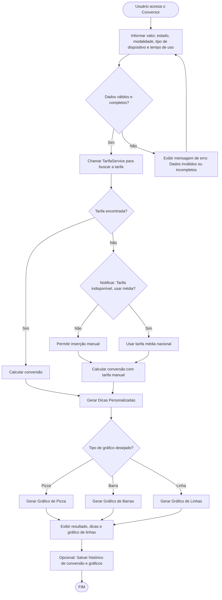
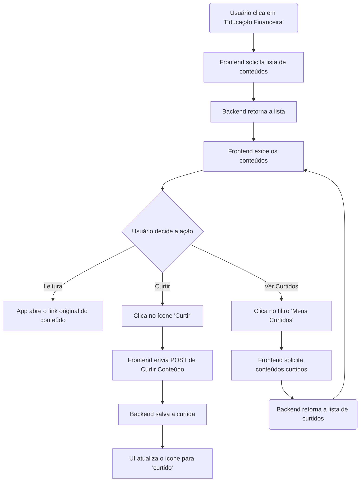
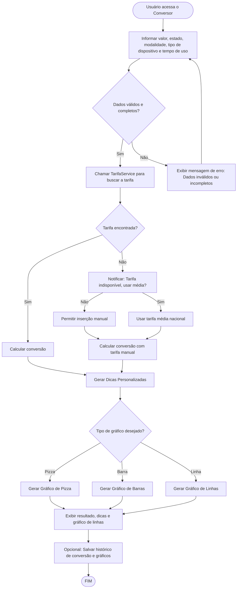
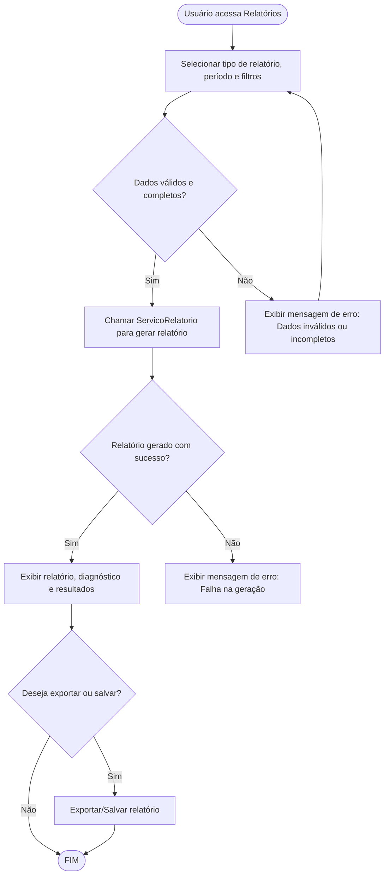
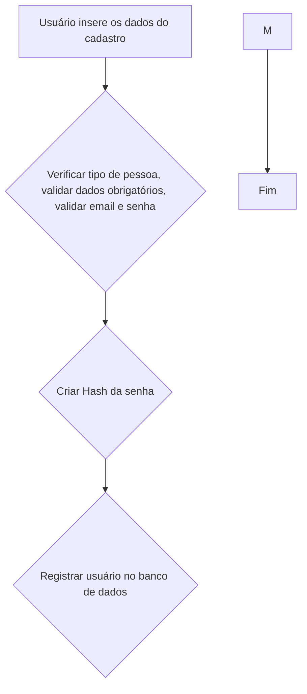
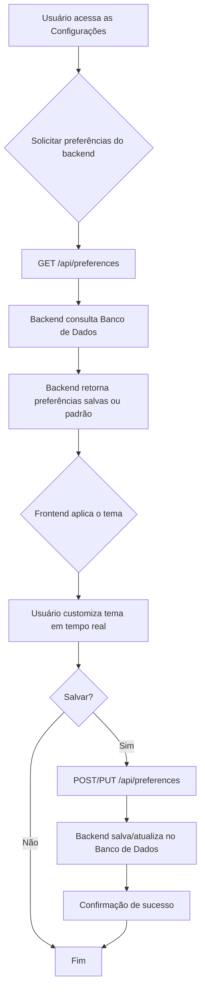
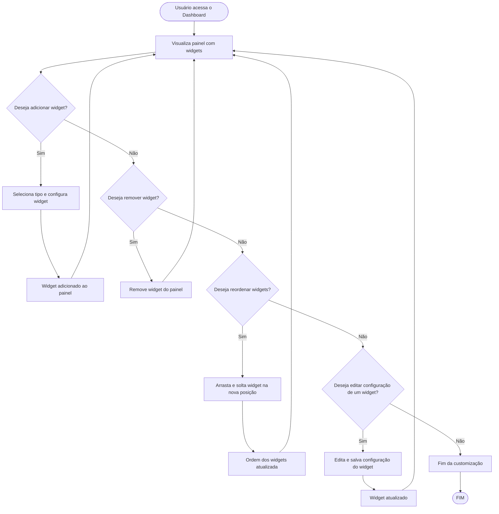
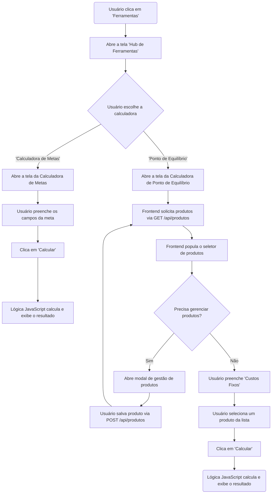
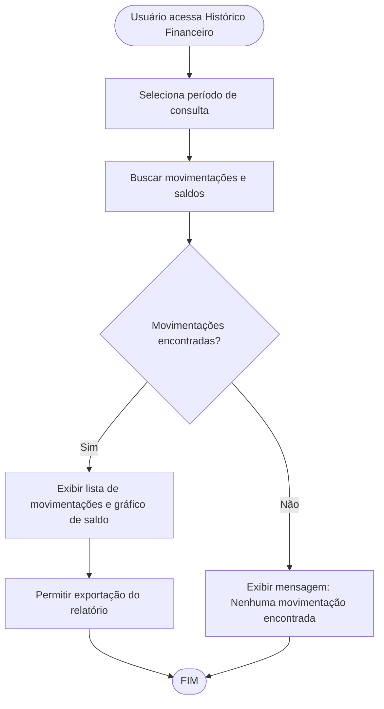

# Projeto de Interface

#### Principais Telas e Funcionalidades

1. **Tela de Login e Cadastro**
  - Formulário de autenticação
  - Processo de registro de novos usuários
  - Recuperação de senha

2. **Dashboard Principal**
  - Visão geral das finanças
  - Gráficos de receitas vs despesas
  - Resumo mensal e anual
  - Navegação para funcionalidades principais

3. **Gestão de Transações**
  - Formulário para adicionar receitas e despesas
  - Lista de transações com filtros
  - Edição e exclusão de transações
  - Categorização automática e manual

4. **Relatórios e Análises**
  - Gráficos interativos
  - Filtros por período e categoria
  - Exportação de dados
  - Comparativos mensais/anuais

5. **Configurações e Perfil**
  - Dados pessoais do usuário
  - Preferências da aplicação
  - Categorias personalizadas
  - Configurações de notificações

# Projeto de Interface — R3 Conversor de Energia

## 1. Modelos Funcionais

### 1.1 Diagrama de Fluxo (Fluxograma)

Este diagrama representa o fluxo de execução para a funcionalidade de conversão de energia, desde a entrada de dados do usuário até a exibição do resultado e das dicas.

# Projeto de Interface — R2 Educação Financeira

## 1. Modelos Funcionais

### 1.1 Diagrama de Fluxo (Fluxograma)

O diagrama a seguir representa o fluxo de interação do usuário para acessar, interagir (curtir) e visualizar o conteúdo educativo, detalhando a comunicação com o backend para buscar artigos agregados e gerenciar os favoritos do usuário.

# Projeto de Interface — R3 Conversor de Energia

## 1. Modelos Funcionais

### 1.1 Diagrama de Fluxo (Fluxograma)

Este diagrama representa o fluxo de execução para a funcionalidade de conversão de energia, desde a entrada de dados do usuário até a exibição do resultado e das dicas.

# Projeto de Interface — R4 Relatórios, Diagnósticos e Resultados

## 1. Modelos Funcionais

### 1.1 Diagrama de Fluxo (Fluxograma)

Este diagrama representa o fluxo de execução para a funcionalidade de geração de relatórios, diagnósticos e resultados, desde a solicitação do usuário até a exibição do relatório detalhado.

# Projeto de Interface — R3 Conversor de Energia

## 1. Modelos Funcionais

### 1.1 Diagrama de Fluxo (Fluxograma)

Este diagrama representa o fluxo de execução para a funcionalidade de conversão de energia, desde a entrada de dados do usuário até a exibição do resultado e das dicas.

# Projeto de Interface — R8 Personalização do Tema

## 1. Modelos Funcionais

### 1.1 Diagrama de Fluxo (Fluxograma)

O diagrama a seguir representa o fluxo de interação do usuário para personalizar e salvar o tema, detalhando a comunicação com o backend e a persistência.

---

# Projeto de Interface — R9 Metas Financeiras

## 1. Modelos Funcionais

### 1.1 Diagrama de Fluxo (Fluxograma)

Este diagrama representa o fluxo de execução para a funcionalidade de metas financeiras, desde a criação da meta até o acompanhamento e conclusão.

### 1.2 Protótipos de Telas (Sugestão)

- **Tela de Listagem de Metas:**
    - Lista todas as metas do usuário, mostrando título, valor objetivo, valor atual, progresso (%) e status (em andamento/concluída).
    - Botão para criar nova meta.
    - Ações: visualizar detalhes, editar, remover.

- **Tela de Detalhes da Meta:**
    - Exibe informações completas da meta.
    - Lista de aportes realizados (data, valor).
    - Campo para registrar novo aporte.
    - Indicador visual de progresso (barra ou círculo).
    - Botão para editar/remover meta.

- **Tela de Criação/Edição de Meta:**
    - Formulário para inserir/editar título, valor objetivo, data limite, descrição.
    - Validação de campos obrigatórios.

- **Feedback Visual:**
    - Mensagens de sucesso, erro e conclusão de meta.
    - Indicadores de progresso e status.

# Projeto de Interface — R10 Dashboard Personalizado

## 1. Modelos Funcionais

### 1.1 Diagrama de Fluxo (Fluxograma)

Este diagrama representa o fluxo de customização do dashboard financeiro, incluindo adição, remoção, configuração e reordenação (drag and drop) de widgets.

# Projeto de Interface — R11 Avisos e Notificações

## 1. Modelos Funcionais

### 1.1 Diagrama de Fluxo (Fluxograma)

Este diagrama representa o fluxo de exibição e interação com avisos e notificações, incluindo visualização, marcação como lida e atualização de indicadores visuais.

# Projeto de Interface — R15 Ferramentas Interativas

## 1. Modelos Funcionais

### 1.1 Diagrama de Fluxo (Fluxograma)

O diagrama a seguir representa a jornada do usuário para acessar o hub de ferramentas, escolher uma calculadora e interagir com e o fluxograma detalha os dois principais casos de uso do MVP: a "Calculadora de Metas" (com lógica no frontend) e a "Calculadora de Ponto de Equilíbrio", que requer comunicação com o backend para gerenciar uma lista de produtos cadastrados pelo usuário.

# Projeto de Interface — R16 Histórico Financeiro

## 1. Modelos Funcionais

### 1.1 Diagrama de Fluxo (Fluxograma)

Este diagrama representa o fluxo de visualização do histórico financeiro, desde a seleção do período até a exibição dos saldos e movimentações.

## 2. Protótipos de Telas

- Tela de seleção de período
- Lista de movimentações (com filtros por categoria, tipo, valor)
- Gráfico de evolução do saldo
- Botão para exportar relatório (PDF/Excel)

## 3. Requisitos de Interface

- Interface clara e intuitiva
- Gráficos responsivos
- Filtros avançados para busca de movimentações
- Opção de exportação de dados

