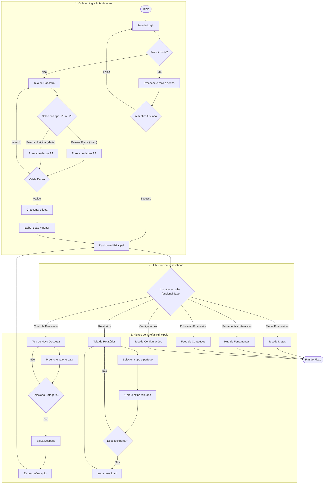
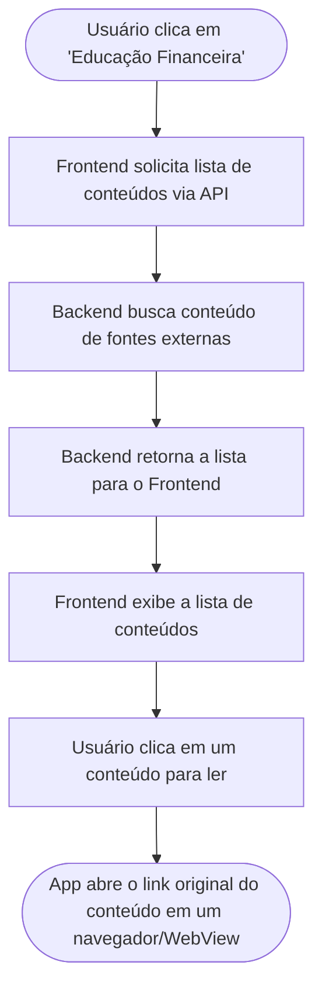
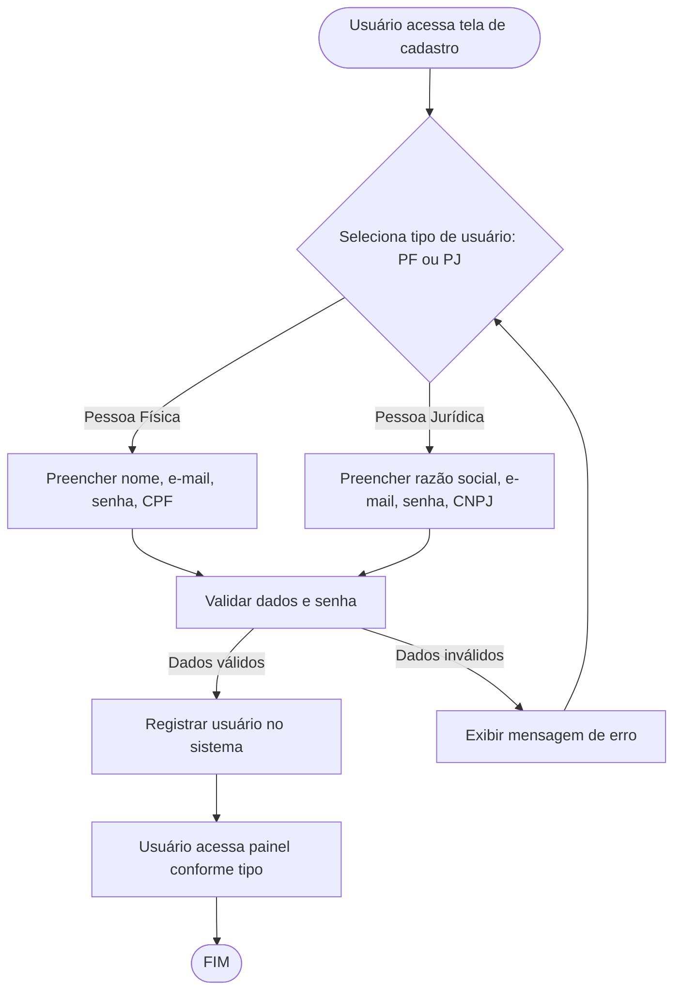
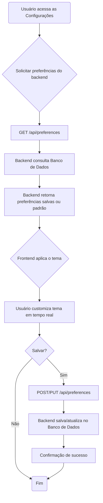
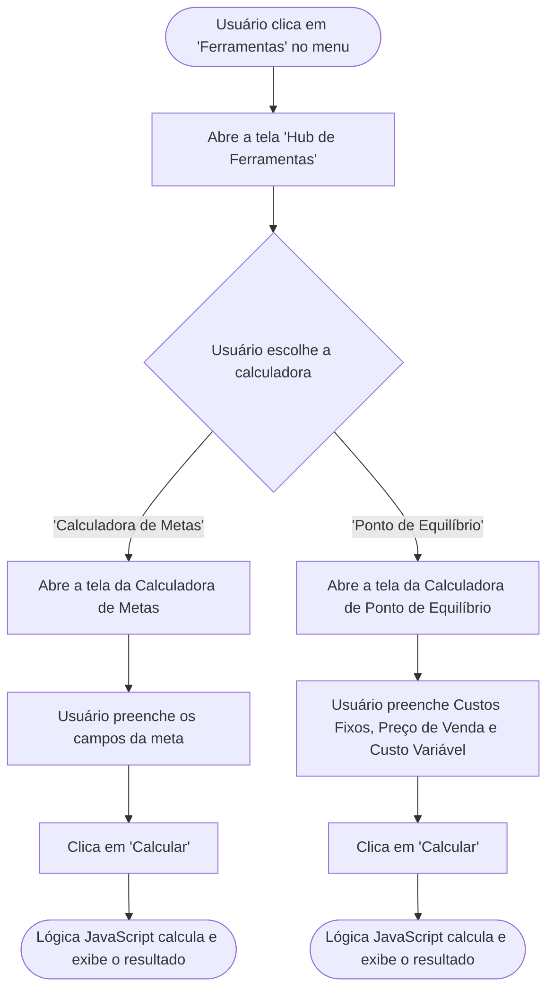

# Projeto de Interface

> **Pré-requisito:** [Documentação de Especificação](2-Especificação%20do%20Projeto.md)

## Visão Geral

Visão geral da interação do usuário pelas telas do sistema. Esta seção apresenta as principais interfaces da plataforma e os fluxogramas que detalham a jornada do usuário e as interações com cada funcionalidade principal do sistema.

## Principais Telas e Funcionalidades

- **Tela de Login e Cadastro**
    - Formulário de autenticação
    - Processo de registro de novos usuários
    - Recuperação de senha

- **Dashboard Principal**
    - Visão geral das finanças
    - Gráficos de receitas vs despesas
    - Resumo mensal e anual
    - Navegação para funcionalidades principais

- **Gestão de Transações**
    - Formulário para adicionar receitas e despesas
    - Lista de transações com filtros
    - Edição e exclusão de transações
    - Categorização automática e manual

- **Relatórios e Análises**
    - Gráficos interativos
    - Filtros por período e categoria
    - Exportação de dados
    - Comparativos mensais/anuais

- **Configurações e Perfil**
    - Dados pessoais do usuário
    - Preferências da aplicação
    - Categorias personalizadas
    - Configurações de notificações

## Diagrama de Fluxo Geral do Save Money v2

O diagrama a seguir representa a jornada completa do usuário dentro do aplicativo, desde o primeiro contato até a utilização das funcionalidades chave. Ele integra os fluxos das duas personas principais, João (Pessoa Física) e Maria (Pessoa Jurídica), em um único mapa de interação para fornecer uma visão holística do sistema.

Snippet de código

Fluxogramas Detalhados por Funcionalidade

R1 — Controle Financeiro

Este diagrama representa o fluxo de execução para a funcionalidade de registro de receitas e despesas, desde a entrada de dados do usuário até a confirmação do registro e atualização do saldo.

Snippet de código

Protótipos de Telas

### Protótipos de Telas

- **Tela de Cadastro de Receita/Despesa:**
    - Campos para valor, categoria, tipo, data e descrição
    - Botão de salvar

- **Tela de Listagem:**
    - Exibe histórico de registros financeiros
    - Filtros por período, categoria e tipo

- **Tela de Saldo:**
    - Mostra saldo atual, total de receitas e despesas

#### Navegação
- O usuário pode acessar o cadastro a partir do menu principal.
- Após o registro, retorna à tela de listagem com atualização automática.
- Opção de editar ou remover registros existentes.

O diagrama a seguir representa o fluxo de interação do usuário para acessar e visualizar o conteúdo educativo.

### R2 — Educação Financeira

O diagrama a seguir representa o fluxo de interação do usuário para acessar e visualizar o conteúdo educativo.

Snippet de código

Este diagrama representa o fluxo de execução para a funcionalidade de conversão de energia, desde a entrada de dados do usuário até a exibição do resultado e das dicas.

### R3 — Conversor de Energia

Este diagrama representa o fluxo de execução para a funcionalidade de conversão de energia, desde a entrada de dados do usuário até a exibição do resultado e das dicas.

Snippet de código

Este diagrama representa o fluxo de execução para a funcionalidade de geração de relatórios, desde a solicitação do usuário até a exibição do relatório detalhado.

### R4 — Relatórios, Diagnósticos e Resultados

Este diagrama representa o fluxo de execução para a funcionalidade de geração de relatórios, desde a solicitação do usuário até a exibição do relatório detalhado.

Snippet de código

Este diagrama representa o fluxo de cadastro e uso do sistema por usuários Pessoa Física e Pessoa Jurídica.

### R6/R7 — Cadastro Pessoa Física/Jurídica

Este diagrama representa o fluxo de cadastro e uso do sistema por usuários Pessoa Física e Pessoa Jurídica.

Snippet de código

Protótipos de Telas

### Protótipos de Telas

- **Tela de Cadastro:**
    - Seleção de tipo (PF/PJ)
    - Campos dinâmicos para CPF ou CNPJ, nome ou razão social, e-mail, senha

- **Tela de Login:**
    - E-mail e senha

- **Tela de Perfil:**
    - Exibe dados do usuário, tipo de conta, opção de editar informações

- **Painel Pessoa Física:**
    - Funcionalidades voltadas para controle financeiro pessoal, metas, histórico

- **Painel Pessoa Jurídica:**
    - Funcionalidades para gestão financeira empresarial, relatórios, fluxo de caixa

#### Navegação
- O usuário pode alternar entre cadastro e login.
- Após cadastro/login, é direcionado ao painel correspondente ao tipo de usuário.
- Opção de editar perfil e trocar tipo de conta (se permitido).
- Funcionalidades e menus adaptados conforme PF ou PJ.

O diagrama a seguir representa o fluxo de interação do usuário para personalizar e salvar o tema.

### R8 — Personalização do Tema

O diagrama a seguir representa o fluxo de interação do usuário para personalizar e salvar o tema.

Snippet de código

Este diagrama representa o fluxo de execução para a funcionalidade de metas financeiras, desde a criação da meta até o acompanhamento e conclusão.

### R9 — Metas Financeiras

Este diagrama representa o fluxo de execução para a funcionalidade de metas financeiras, desde a criação da meta até o acompanhamento e conclusão.

Snippet de código

Este diagrama representa o fluxo de customização do dashboard financeiro.

### R10 — Dashboard Personalizado

Este diagrama representa o fluxo de customização do dashboard financeiro.

Snippet de código

Este diagrama representa o fluxo de exibição e interação com avisos e notificações.

### R11 — Avisos e Notificações

Este diagrama representa o fluxo de exibição e interação com avisos e notificações.

Snippet de código

O diagrama a seguir representa a jornada do usuário para acessar o hub de ferramentas e utilizar as calculadoras.

### R15 — Ferramentas Interativas

O diagrama a seguir representa a jornada do usuário para acessar o hub de ferramentas e utilizar as calculadoras.

Snippet de código

Este diagrama representa o fluxo de visualização do histórico financeiro.

### R16 — Histórico Financeiro

Este diagrama representa o fluxo de visualização do histórico financeiro.

Snippet de código

