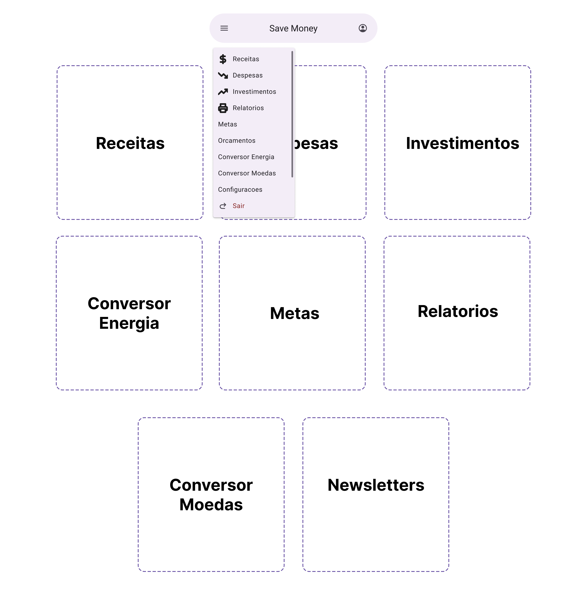
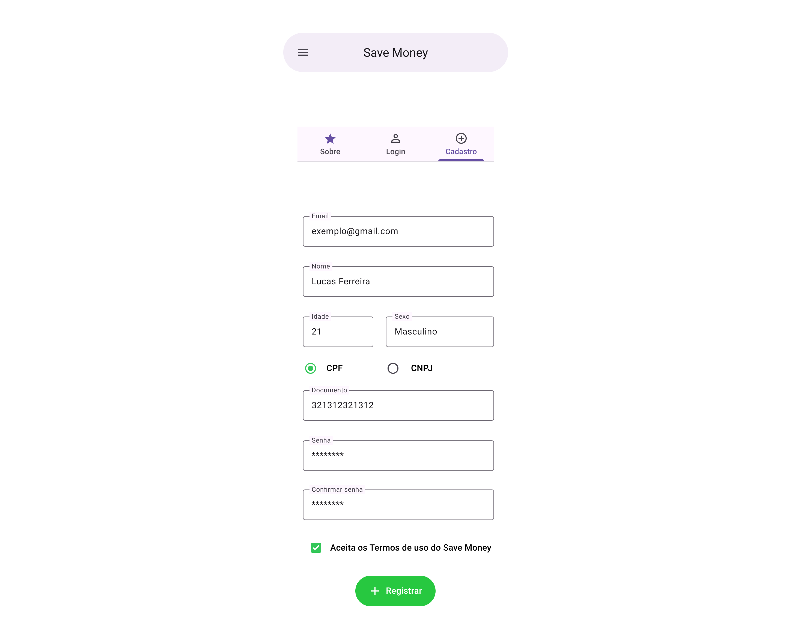
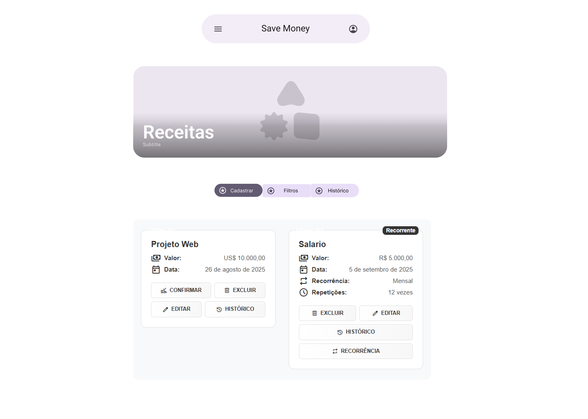
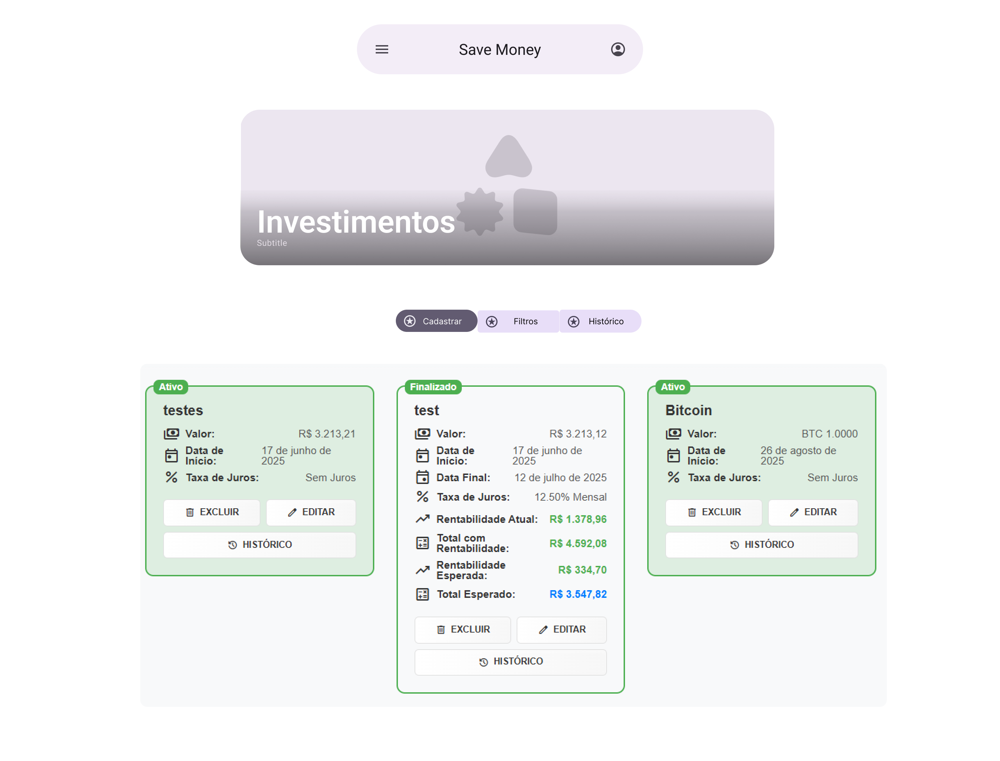
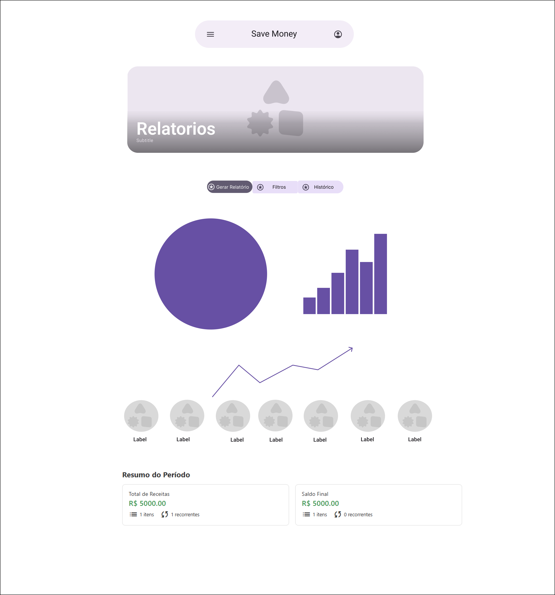
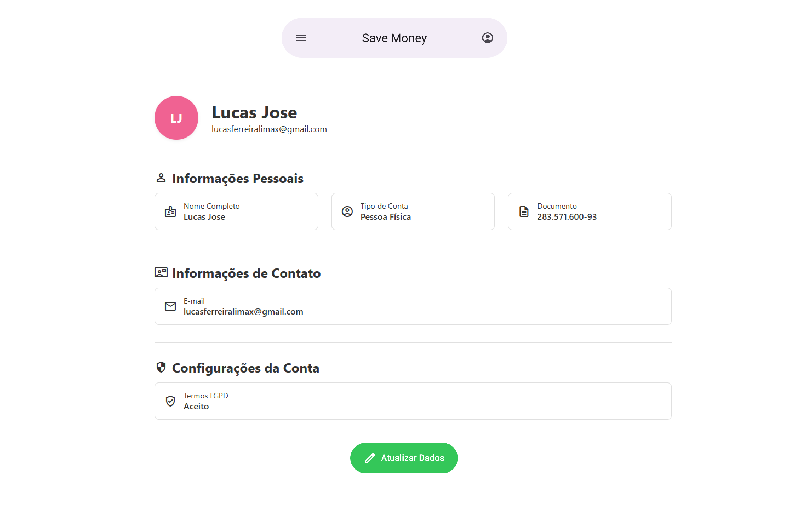
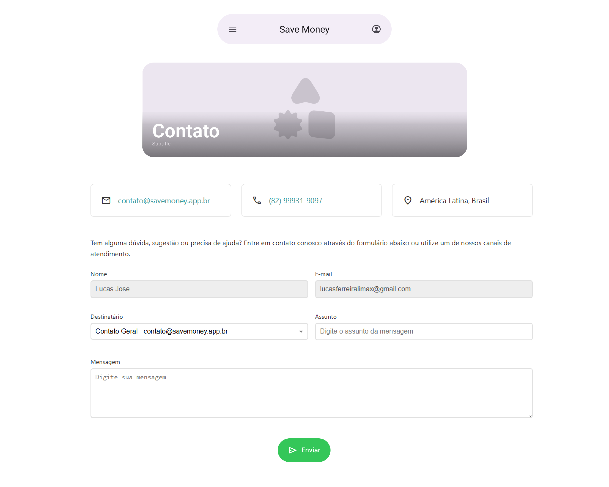
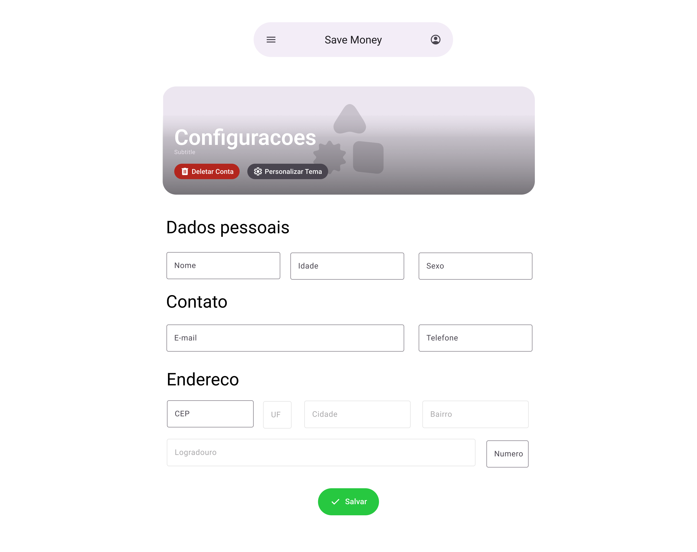

# Projeto de Interface

## Principais Telas e Funcionalidades

1. **Tela Inicial Pública / Sobre Nós**
  - Apresenta a missão do sistema, opções de login, cadastro, funcionalidades e newsletters

2. **Tela de Login**
  - Permite acessar o sistema informando e-mail e senha

3. **Tela de Cadastro**
  - Permite criar uma conta, selecionando o tipo de pessoa e preenchendo os dados obrigatórios

4. **Dashboard Principal**
  - Exibe navegação para todas as principais funcionalidades do sistema

5. **Receitas**
  - Visualizar, cadastrar, editar e excluir receitas, com informações detalhadas e filtros

6. **Despesas**
  - Visualizar, cadastrar, editar e excluir despesas, com informações detalhadas e filtros

7. **Investimentos**
  - Gerenciar investimentos, exibir status, rentabilidade e histórico

8. **Relatórios**
  - Exibe gráficos e resumos financeiros para análise do usuário

9. **Perfil do Usuário**
  - Visualizar e editar informações pessoais, contato e configurações da conta

10. **Contato**
  - Entrar em contato com a equipe de suporte por meio de formulário

11. **Configurações**
  - Editar dados pessoais, contato, endereço e personalizar o tema

12. **Conversor de Moedas**
  - Ferramenta para conversão de moedas, com histórico e dicas

13. **Conversor de Energia**
  - Ferramenta para simulação e cálculo de consumo de energia

14. **Dicas de Energia**
  - Exibe dicas personalizadas relacionadas ao consumo de energia


## Wireframes

Abaixo estão os wireframes que ilustram o template padrão da aplicação, com seus respectivos títulos e descrições.

### Tela Inicial Pública / Sobre Nós

Apresenta a missão do sistema, opções de login, cadastro, funcionalidades e newsletters.


---

### Tela Dashboard

Exibe navegação para todas as principais funcionalidades do sistema.



---

### Tela de Login

Permite acessar o sistema informando e-mail e senha.


---

### Tela de Cadastro

Permite criar uma conta, selecionando o tipo de pessoa e preenchendo os dados obrigatórios.



---

### Tela de Receitas

Permite visualizar, cadastrar, editar e excluir receitas, com informações detalhadas e filtros.



---

### Tela de Despesas

Permite visualizar, cadastrar, editar e excluir despesas, com informações detalhadas e filtros.


---

### Tela de Investimentos

Permite gerenciar investimentos, exibir status, rentabilidade e histórico.



---

### Tela de Relatórios

Exibe gráficos e resumos financeiros para análise do usuário.



---

### Tela de Perfil do Usuário

Permite visualizar e editar informações pessoais, contato e configurações da conta.



---

### Tela de Contato

Permite entrar em contato com a equipe de suporte por meio de formulário.



---

### Tela de Configurações

Permite editar dados pessoais, contato, endereço e personalizar o tema.



---

### Tela Conversor de Moedas

Ferramenta para conversão de moedas, com histórico e dicas.


---

### Tela Conversor de Energia

Ferramenta para simulação e cálculo de consumo de energia.


---

### Tela Dicas de Energia

Exibe dicas personalizadas relacionadas ao consumo de energia.


---

# Projeto de Interface — R1 Controle Financeiro

## 1. Modelos Funcionais

### 1.1 Diagrama de Fluxo (Fluxograma)

Este diagrama representa o fluxo de execução para a funcionalidade de registro de receitas e despesas, desde a entrada de dados do usuário até a confirmação do registro e atualização do saldo.


## 2. Protótipos de Telas

- Tela de Cadastro de Receita/Despesa: Campos para valor, categoria, tipo, data e descrição, botão de salvar.
- Tela de Listagem: Exibe histórico de registros financeiros, filtros por período, categoria e tipo.
- Tela de Saldo: Mostra saldo atual, total de receitas e despesas.

## 3. Navegação

- O usuário pode acessar o cadastro a partir do menu principal.
- Após o registro, retorna à tela de listagem com atualização automática.
- Opção de editar ou remover registros existentes.

# Projeto de Interface — R2 Educação Financeira

## 1. Modelos Funcionais

### 1.1 Diagrama de Fluxo (Fluxograma)

O diagrama a seguir representa o fluxo de interação do usuário para acessar, interagir (curtir) e visualizar o conteúdo educativo, detalhando a comunicação com o backend para buscar artigos agregados e gerenciar os favoritos do usuário.


# Projeto de Interface — R3 Conversor de Energia

## 1. Modelos Funcionais

### 1.1 Diagrama de Fluxo (Fluxograma)

Este diagrama representa o fluxo de execução para a funcionalidade de conversão de energia, desde a entrada de dados do usuário até a exibição do resultado e das dicas.


# Projeto de Interface — R4 Relatórios, Diagnósticos e Resultados

## 1. Modelos Funcionais

### 1.1 Diagrama de Fluxo (Fluxograma)

Este diagrama representa o fluxo de execução para a funcionalidade de geração de relatórios, diagnósticos e resultados, desde a solicitação do usuário até a exibição do relatório detalhado.


# Projeto de Interface — R5 Exportação e Compartilhamento
## 1. Modelos Funcionais
### 1.1 Diagrama de Fluxo (Fluxograma)
Este diagrama representa o fluxo de interação do usuário para as funcionalidades de exportação e compartilhamento de um relatório. O fluxo se inicia a partir do momento em que um relatório (requisito R4) já está sendo exibido na tela, detalhando os passos para a geração do arquivo no backend e a subsequente ação de compartilhamento no frontend.

```mermaid
graph TD
    A[Usuário visualiza um relatório na tela] --> B[Clica no botão 'Exportar'];
    B --> C{Escolhe o formato do arquivo};
    C -- PDF --> D["Frontend envia requisição para API (formato=PDF)"];
    C -- Excel --> E["Frontend envia requisição para API (formato=Excel)"];

    subgraph Processamento no Backend
        D --> F[Backend gera o arquivo .pdf];
        E --> G[Backend gera o arquivo .xlsx];
    end

    F --> H[Backend retorna o arquivo para download];
    G --> H;

    H --> I[Navegador inicia o download do arquivo];
    I --> J{Deseja compartilhar o arquivo?};
    J -- Sim --> K[Clica no botão 'Compartilhar'];
    K --> L[Frontend aciona a API de compartilhamento nativa do dispositivo];
    L --> M[Usuário seleciona app (WhatsApp, E-mail, etc.) e envia];

    J -- Não --> N([Fim da Interação]);
    M --> N;
```

# Projeto de Interface — R6/R7 Pessoa Física/Jurídica

## 1. Modelos Funcionais

### 1.1 Diagrama de Fluxo (Fluxograma)

Este diagrama representa o fluxo de cadastro e uso do sistema por usuários Pessoa Física e Pessoa Jurídica, desde a entrada dos dados até a diferenciação de funcionalidades.


## 2. Protótipos de Telas

- Tela de Cadastro: Seleção de tipo (PF/PJ), campos dinâmicos para CPF ou CNPJ, nome ou razão social, e-mail, senha.
- Tela de Login: E-mail e senha.
- Tela de Perfil: Exibe dados do usuário, tipo de conta, opção de editar informações.
- Painel Pessoa Física: Funcionalidades voltadas para controle financeiro pessoal, metas, histórico.
- Painel Pessoa Jurídica: Funcionalidades para gestão financeira empresarial, relatórios, fluxo de caixa.

## 3. Navegação

- O usuário pode alternar entre cadastro e login.
- Após cadastro/login, é direcionado ao painel correspondente ao tipo de usuário.
- Opção de editar perfil e trocar tipo de conta (se permitido).
- Funcionalidades e menus adaptados conforme PF ou PJ.

# Projeto de Interface — R8 Personalização do Tema

## 1. Modelos Funcionais

### 1.1 Diagrama de Fluxo (Fluxograma)

O diagrama a seguir representa o fluxo de interação do usuário para personalizar e salvar o tema, detalhando a comunicação com o backend e a persistência.


---

# Projeto de Interface — R9 Metas Financeiras

## 1. Modelos Funcionais

### 1.1 Diagrama de Fluxo (Fluxograma)

Este diagrama representa o fluxo de execução para a funcionalidade de metas financeiras, desde a criação da meta até o acompanhamento e conclusão.


### 1.2 Protótipos de Telas (Sugestão)

- **Tela de Listagem de Metas:**

  - Lista todas as metas do usuário, mostrando título, valor objetivo, valor atual, progresso (%) e status (em andamento/concluída).
  - Botão para criar nova meta.
  - Ações: visualizar detalhes, editar, remover.

- **Tela de Detalhes da Meta:**

  - Exibe informações completas da meta.
  - Lista de aportes realizados (data, valor).
  - Campo para registrar novo aporte.
  - Indicador visual de progresso (barra ou círculo).
  - Botão para editar/remover meta.

- **Tela de Criação/Edição de Meta:**

  - Formulário para inserir/editar título, valor objetivo, data limite, descrição.
  - Validação de campos obrigatórios.

- **Feedback Visual:**
  - Mensagens de sucesso, erro e conclusão de meta.
  - Indicadores de progresso e status.

# Projeto de Interface — R10 Dashboard Personalizado

## 1. Modelos Funcionais

### 1.1 Diagrama de Fluxo (Fluxograma)

Este diagrama representa o fluxo de customização do dashboard financeiro, incluindo adição, remoção, configuração e reordenação (drag and drop) de widgets.


# Projeto de Interface — R11 Avisos e Notificações

## 1. Modelos Funcionais

### 1.1 Diagrama de Fluxo (Fluxograma)

Este diagrama representa o fluxo de exibição e interação com avisos e notificações, incluindo visualização, marcação como lida e atualização de indicadores visuais.


# Projeto de Interface — R12 Gestão de Orçamento

## 1. Modelos Funcionais

### 1.1 Diagrama de Fluxo (Fluxograma)

Este diagrama representa o fluxo de execução para a funcionalidade de gestão de orçamentos, desde a solicitação do usuário até a criação, consulta e ajuste de orçamentos mensais por categoria.

```mermaid
graph TD
    A([Usuário acessa Gestão de Orçamento]) --> B[Selecionar categoria e período (mês/ano)]
    B --> C{Deseja criar, editar ou consultar?}
    C -- Criar --> D[Informar valor limite e confirmar]
    D --> E[Validar dados de entrada]
    E -- Válido --> F[Salvar orçamento no banco de dados]
    E -- Inválido --> G[Exibir mensagem de erro e solicitar correção]
    F --> H[Exibir confirmação de criação]
    G --> B

    C -- Editar --> I[Selecionar orçamento existente]
    I --> J[Alterar valor limite e confirmar]
    J --> E

    C -- Consultar --> K[Listar orçamentos do período]
    K --> L[Exibir detalhes: categoria, limite, gasto, saldo]
    L --> M{Deseja ajustar orçamento?}
    M -- Sim --> I
    M -- Não --> N([FIM])
    H --> N
```

# Projeto de Interface — R13 Análise de Tendências

## 1. Modelos Funcionais

### 1.1 Diagrama de Fluxo (Fluxograma)

Este diagrama representa o fluxo de execução para a funcionalidade de análise de tendências financeiras, desde a solicitação do usuário até a exibição dos resultados e recomendações.


### 1.2 Telas Principais

#### Tela: Dashboard de Tendências

- **Componentes:**
  - Filtros de período (ex: últimos 3, 6, 12 meses)
  - Filtro de categoria (dropdown)
  - Botão "Analisar"
  - Lista de tendências por categoria (exibe tipo da tendência: Alta, Baixa, Estável)
  - Gráfico de linha com evolução dos gastos no período selecionado
  - Recomendações e descrição textual da análise
  - Botão "Exportar" (PDF/CSV)

#### Tela: Detalhe da Tendência

- **Componentes:**
  - Nome da categoria analisada
  - Gráfico detalhado dos valores mensais
  - Texto explicativo da tendência identificada
  - Recomendações personalizadas
  - Botão "Voltar" para o dashboard

### 1.3 Comportamento Esperado

- Ao acessar a Análise de Tendências, o usuário pode selecionar uma categoria e um período.
- O sistema exibe o resultado da análise, incluindo:
  - Tipo de tendência (Alta, Baixa, Estável)
  - Gráfico de evolução dos gastos
  - Recomendações e explicações em linguagem simples
- Caso não haja dados suficientes, uma mensagem informativa é exibida.
- O usuário pode exportar o resultado da análise.

## 2. Observações

- A interface deve ser responsiva e acessível.
- Os gráficos devem ser claros, com legendas e destaques para mudanças significativas.
- Recomendações devem ser objetivas e contextualizadas conforme o padrão identificado.

# Projeto de Interface — R14 Projeção Financeira

## 1. Modelos Funcionais

### 1.1 Diagrama de Fluxo (Fluxograma)

Este diagrama representa o fluxo de execução para a funcionalidade de Projeção Financeira, desde a solicitação do usuário até a exibição da projeção e exportação dos resultados.

```mermaid
graph TD
    A([Usuário acessa Projeção Financeira]) --> B[Seleciona o período para a projeção (ex: 6, 12 meses)]
    B --> C{"Existem dados históricos suficientes?"}
    C -- Sim --> D[Backend calcula a projeção]
    C -- Não --> E[Exibir mensagem: Dados insuficientes para projetar]
    E --> B
    D --> F{"Projeção gerada com sucesso?"}
    F -- Sim --> G[Exibir projeção: gráfico e resumo]
    F -- Não --> H[Exibir mensagem de erro: Falha ao gerar projeção]
    G --> I{Deseja exportar ou salvar?}
    I -- Sim --> J[Exportar/Salvar projeção]
    I -- Não --> K([FIM])
    J --> K
```

### 1.2 Telas Principais

#### Tela: Projeção Financeira

- **Componentes:**
  - Filtro de período para projeção (ex: dropdown com 3, 6, 12 meses)
  - Botão "Gerar Projeção"
  - Gráfico de linhas mostrando a evolução do saldo projetado mês a mês
  - Resumo textual da projeção (ex: "Seu saldo projetado para 6 meses é R$ X.XXX,XX")
  - Mensagens de erro ou alerta caso não haja dados suficientes
  - Botão "Exportar" (PDF/CSV)

#### Tela: Detalhe da Projeção

- **Componentes:**
  - Gráfico detalhado com valores de saldo projetado por mês
  - Tabela opcional com os valores mês a mês
  - Texto explicativo sobre a metodologia da projeção
  - Botão "Voltar" para a tela principal

### 1.3 Comportamento Esperado

- O usuário seleciona o período desejado e solicita a projeção.
- O sistema exibe o gráfico de saldo projetado e um resumo textual.
- Caso não haja dados suficientes, uma mensagem informativa é exibida.
- O usuário pode exportar a projeção em PDF ou CSV.

## 2. Observações

- A interface deve ser responsiva e acessível.
- Os gráficos devem ser claros, com legendas e destaques para variações relevantes.
- O resumo textual deve ser objetivo e fácil de entender.

# Projeto de Interface — R15 Ferramentas Interativas

## 1. Modelos Funcionais

### 1.1 Diagrama de Fluxo (Fluxograma)

O diagrama a seguir representa a jornada do usuário para acessar o hub de ferramentas e utilizar as calculadoras. Conforme a decisão de arquitetura, ambas as ferramentas operam inteiramente no frontend (client-side), com os cálculos sendo executados em tempo real a partir dos dados inseridos manualmente pelo usuário.


# Projeto de Interface — R16 Histórico Financeiro

## 1. Modelos Funcionais

### 1.1 Diagrama de Fluxo (Fluxograma)

Este diagrama representa o fluxo de visualização do histórico financeiro, desde a seleção do período até a exibição dos saldos e movimentações.


## 2. Protótipos de Telas

- Tela de seleção de período
- Lista de movimentações (com filtros por categoria, tipo, valor)
- Gráfico de evolução do saldo
- Botão para exportar relatório (PDF/Excel)

## 3. Requisitos de Interface

- Interface clara e intuitiva
- Gráficos responsivos
- Filtros avançados para busca de movimentações
- Opção de exportação de dados

