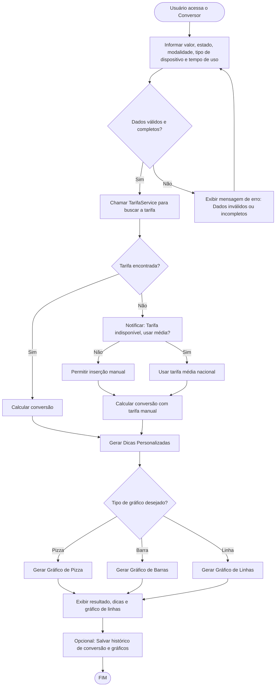

# Projeto de Interface — R15 Ferramentas Interativas

## 1. Modelos Funcionais

### 1.1 Diagrama de Fluxo (Fluxograma)

O diagrama a seguir representa a jornada do usuário para acessar o hub de ferramentas, escolher uma calculadora e interagir com e o fluxograma detalha os dois principais casos de uso do MVP: a "Calculadora de Metas" (com lógica no frontend) e a "Calculadora de Ponto de Equilíbrio", que requer comunicação com o backend para gerenciar uma lista de produtos cadastrados pelo usuário.

# Projeto de Interface — R2 Educação Financeira

## 1. Modelos Funcionais

### 1.1 Diagrama de Fluxo (Fluxograma)

O diagrama a seguir representa o fluxo de interação do usuário para acessar, interagir (curtir) e visualizar o conteúdo educativo, detalhando a comunicação com o backend para buscar artigos agregados e gerenciar os favoritos do usuário.

# Projeto de Interface — R3 Conversor de Energia

## 1. Modelos Funcionais

### 1.1 Diagrama de Fluxo (Fluxograma)

Este diagrama representa o fluxo de execução para a funcionalidade de conversão de energia, desde a entrada de dados do usuário até a exibição do resultado e das dicas.

# Projeto de Interface — R3 Conversor de Energia

## 1. Modelos Funcionais

### 1.1 Diagrama de Fluxo (Fluxograma)

Este diagrama representa o fluxo de execução para a funcionalidade de conversão de energia, desde a entrada de dados do usuário até a exibição do resultado e das dicas.

# Projeto de Interface — R8 Personalização do Tema

## 1. Modelos Funcionais

### 1.1 Diagrama de Fluxo (Fluxograma)

O diagrama a seguir representa o fluxo de interação do usuário para personalizar e salvar o tema, detalhando a comunicação com o backend e a persistência.

---

