# Registro de Testes de Software

Pré-requisitos: <a href="3-Projeto de Interface.md"> Projeto de Interface</a>, <a href="8-Plano de Testes de Software.md"> Plano de Testes de Software</a>

Esta seção documenta os resultados da execução dos casos de teste definidos no Plano de Testes de Software. As evidências consistem em **screenshots (imagens .png)**, demonstrando a execução de cada teste e seu resultado.

---

## R1 - Controle Financeiro

| **Caso de Teste** | **CT-R1-001 - Receita** |
| :--- | :--- |
| **Requisito Associado** | **R1** - Usuário deve conseguir criar Receitas |
| **Resultado** | **Aprovado** |
| **Registro de evidência** | 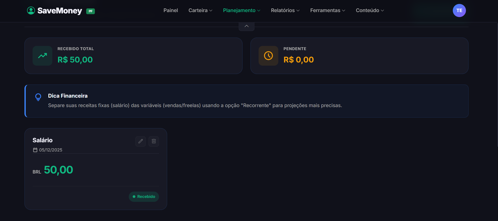   *(A imagem mostra receita criada com sucesso)* |

| **Caso de Teste** | **CT-R1-002 - Despesa** |
| :--- | :--- |
| **Requisito Associado** | **R1** - Usuário deve conseguir criar Despesas |
| **Resultado** | **Aprovado** |
| **Registro de evidência** | 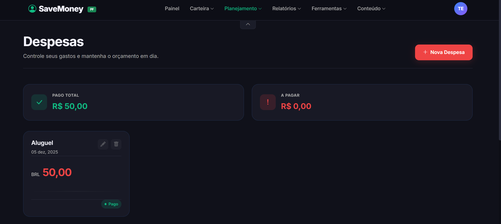   *(A imagem mostra despesa criada com sucesso)* |

### Relatório Específico do R1
**Todos os casos de cadastro, edição e listagem de receitas e despesas foram executados com sucesso. O sistema atualiza o saldo corretamente após cada operação.**

---

## R2 - Educação Financeira

| **Caso de Teste** | **CT-R2-001 – Front-End - Sucesso Artigos** |
| :--- | :--- |
| **Requisito Associado** | **R2** - A interface de Artigos deve carregar e exibir os conteúdos da fonte externa. |
| **Resultado** | **Aprovado** |
| **Registro de evidência** | 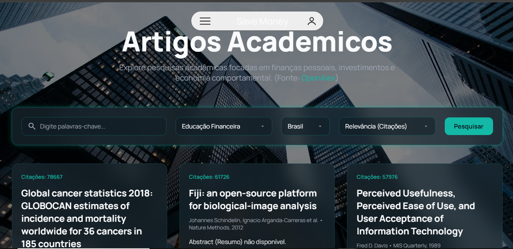   *(A imagem mostra a página de Artigos Acadêmicos carregada com sucesso.)* |

---

| **Caso de Teste** | **CT-R2-002 – Front-End - Sucesso Notícias** |
| :--- | :--- |
| **Requisito Associado** | **R2** - A interface de Notícias deve carregar e exibir os conteúdos da fonte externa. |
| **Resultado** | **Aprovado** |
| **Registro de evidência** |    *(A imagem mostra a página de Notícias do Mercado Financeiro carregada com sucesso.)* |

---

| **Caso de Teste** | **CT-R2-003 – Front-End - Erro (Rota Inexistente)** |
| :--- | :--- |
| **Requisito Associado** | **RNF** - O sistema deve ser resiliente a rotas inválidas (erros de usuário). |
| **Resultado** | **Aprovado** |
| **Registro de evidência** | 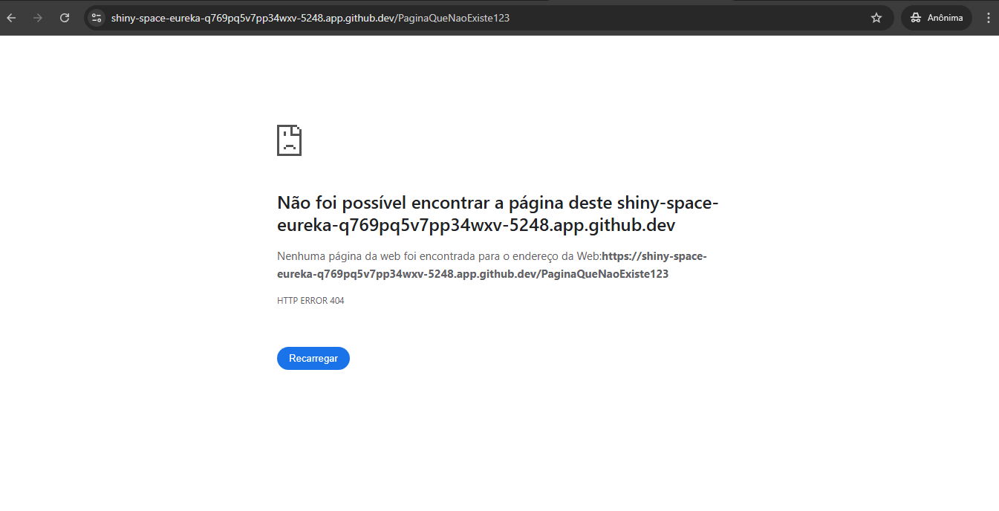   *(A imagem mostra o tratamento de erro da aplicação, exibindo uma página 404 Not Found.)* |

---

### Relatório Específico do R2

Durante a execution dos 3 casos de teste definidos para o front-end do requisito R2 (Educação Financeira), a equipe obteve um total de **3** casos aprovados e **0** casos reprovados.

#### Pontos Fortes (R2)
Os testes revelaram que as funcionalidades principais do front-end, o carregamento das páginas de Artigos (`CT-R2-001`) e Notícias (`CT-R2-002`), funcionaram de forma correta e rápida. A aplicação também demonstrou robustez no tratamento de erros de rota, retornando corretamente a página 404 (`CT-R2-003`).

#### Fragilidades e Falhas Detectadas (R2)
Embora os testes definidos tenham sido aprovados, uma falha funcional foi identificada durante a execução manual: a **funcionalidade de Pesquisa (barra de busca)** não está implementada em nenhuma das telas.

**Descrição da Falha:** Ao inserir texto nas barras de pesquisa de Artigos ou Notícias e clicar em "Buscar" (ou "Pesquisar"), a lista de resultados não é filtrada. A página não reage à busca, pois a lógica de front-end e/ou back-end para essa ação ainda não foi desenvolvida (uma falha intencional devido à priorização na entrega).

**Impacto:** O impacto na usabilidade é **Alto**. Sem a busca, o usuário não pode filtrar o conteúdo e depende exclusivamente da rolagem manual para encontrar o que procura, tornando a funcionalidade pouco prática.

#### Estratégias de Correção e Melhorias (R2)
Para corrigir a(s) falha(s) identificada(s), a equipe planeja as seguintes ações:

1.  **Correção da Falha (Prioridade Alta):** **Implementar a lógica de pesquisa.** É necessário desenvolver a funcionalidade no front-end (para capturar o termo de busca) e no back-end (para filtrar os resultados da API externa) em ambas as telas (Artigos e Notícias).
2.  **Melhoria Proposta (Prioridade Média):** **Implementar feedback de busca vazia.** Como parte da correção, garantir que, se uma busca não retornar resultados, a interface exiba uma mensagem amigável (ex: "Nenhum resultado encontrado"), em vez de apenas uma tela em branco.

---

## R3 - Conversor de Energia

| **Caso de Teste** | **CT-R3-001** |
| :--- | :--- |
| **Requisito Associado** | **R3** - Fornecer um conversor para transformar consumo energético (kWh) em valores monetários, considerando as bandeiras tarifárias via API. |
| **Resultado** | **Aprovado** |
| **Registro de evidência** |  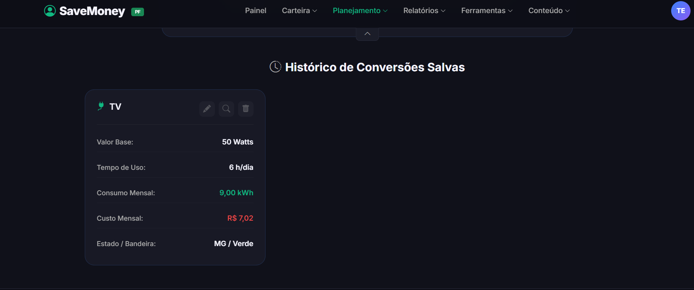   *(A imagem mostra energia convertida com sucesso)* |

### Relatório Específico do R3
**[PREENCHER COM A ANÁLISE DO R3]**

---

## R4 - Relatórios, Diagnósticos e Resultados

| **Caso de Teste** | **CT-R4-001 - Informações gerais** |
| :--- | :--- |
| **Requisito Associado** | **R4** - Gerar relatórios detalhados. |
| **Resultado** | **[Aprovado** |
| **Registro de evidência** | 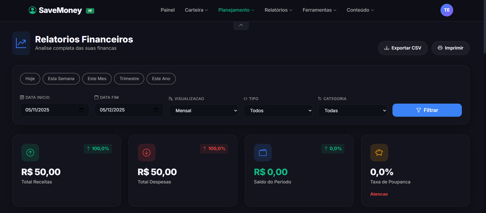   *(A imagem mostra informações financeiras gerais da conta)* |
---

| **Caso de Teste** | **CT-R4-002 - Fluxo Financeiro** |
| :--- | :--- |
| **Requisito Associado** | **R4** - Gerar relatórios detalhados. |
| **Resultado** | **[Aprovado** |
| **Registro de evidência** | 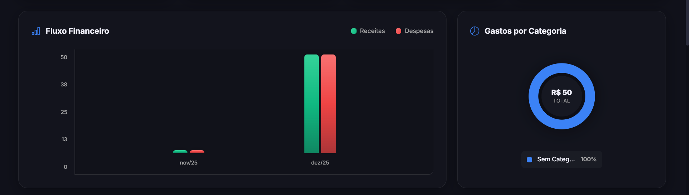   *(A imagem mostra um fluxo financeiro com graficos de barra)* |
---

| **Caso de Teste** | **CT-R4-003 - Diagnóstico Inteligente** |
| :--- | :--- |
| **Requisito Associado** | **R4** - Gerar relatórios detalhados. |
| **Resultado** | **[Aprovado** |
| **Registro de evidência** | 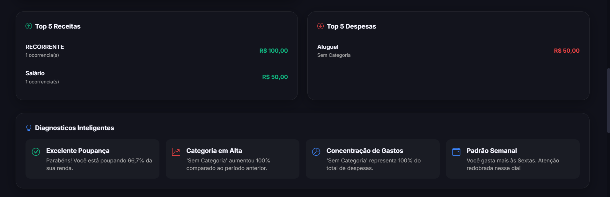   *(A imagem mostra uma analise inteligente sobre a siuação atual da conta)* |
---

| **Caso de Teste** | **CT-R4-004 - Transações detalhadas** |
| :--- | :--- |
| **Requisito Associado** | **R4** - Gerar relatórios detalhados. |
| **Resultado** | **[Aprovado** |
| **Registro de evidência** | 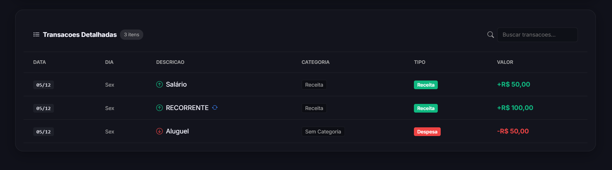   *(A imagem mostra detalhes sobre as transações feitas)* |
---

## R5 - Exportação e Compartilhamento
| **Caso de Teste** | **CT-R5-001 - Exportar para CSV** |
| :--- | :--- |
| **Requisito Associado** | **R5** - Permitir que relatórios sejam exportados em PDF e Excel e compartilhados. |
| **Resultado** | **[Aprovado** |
| **Registro de evidência** |    *(A imagem mostra um arquivo CSV baixado)* |
---
| **Caso de Teste** | **CT-R5-002 - Exportar para PDF** |
| :--- | :--- |
| **Requisito Associado** | **R5** - Permitir que relatórios sejam exportados em PDF e Excel e compartilhados. |
| **Resultado** | **[Aprovado** |
| **Registro de evidência** | 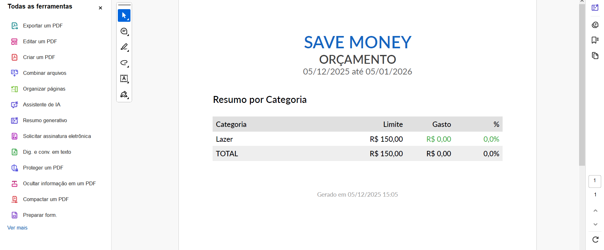   *(A imagem mostra o PDF baixado)* |
---

## R6 - Perfil Pessoa Física
| **Caso de Teste** | **CT-R6-001 - Perfil Pessoa Física** |
| :--- | :--- |
| **Requisito Associado** | **R6** - Disponibilizar funcionalidades específicas para usuários individuais, como metas financeiras pessoais e controle de gastos domésticos. |
| **Resultado** | **[Aprovado** |
| **Registro de evidência** | 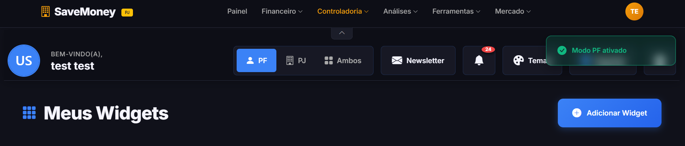   *(Na imagem é mostrado o tipo de perfil ativo)* |
---

## R7 - Perfil Pessoa Jurídica
| **Caso de Teste** | **CT-R7-001 - Perfil Pessoa Jurídica** |
| :--- | :--- |
| **Requisito Associado** | **R7** - Oferecer recursos para empresas, como gestão de fluxo de caixa, controle de despesas operacionais e relatórios gerenciais (DRE simplificado). |
| **Resultado** | **[Aprovado** |
| **Registro de evidência** | 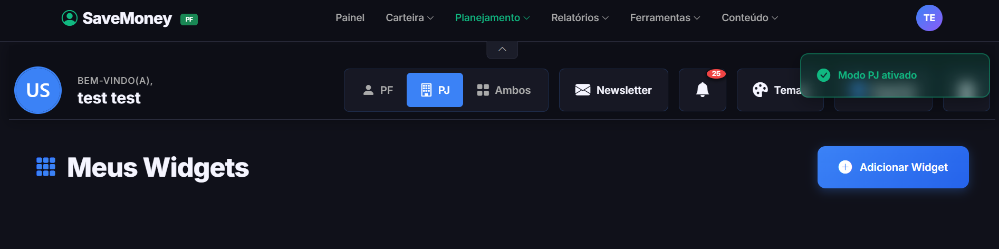   *(Na imagem é mostrado o tipo de perfil ativo)* |
---

## R8 - Personalização do Tema
| **Caso de Teste** | **CT-R8-001 - Personalização do Tema** |
| :--- | :--- |
| **Requisito Associado** | **R8** - Permitir ao usuário escolher temas, esquemas de cores e estilos de interface. |
| **Resultado** | **[Aprovado** |
| **Registro de evidência** |    *(A imagem mostra várias opções de personalização)* |
---

## R9 - Metas Financeiras
| **Caso de Teste** | **CT-R9-001 - Criar Metas** |
| :--- | :--- |
| **Requisito Associado** | **R9** - O usuário pode criar e gerenciar metas financeiras. |
| **Resultado** | **[Aprovado** |
| **Registro de evidência** | 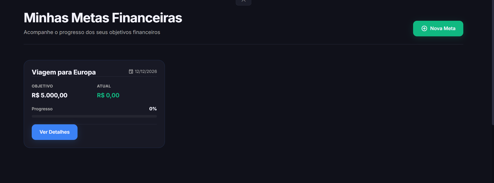   *(A imagem mostra uma Meta Financeira criada)* |
---
| **Caso de Teste** | **CT-R9-002 - Aporte para Metas Financeiras** |
| :--- | :--- |
| **Requisito Associado** | **R9** - O usuário pode criar e gerenciar metas financeiras. |
| **Resultado** | **[Aprovado** |
| **Registro de evidência** | 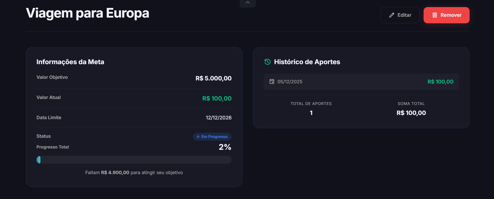   *(A imagem mostra um aporte feita para Metas)* |
---

## R10 - Dashboard Personalizado
| **Caso de Teste** | **CT-R10-001 - Dashboard Personalizado** |
| :--- | :--- |
| **Requisito Associado** | **R10** - Permitir ao usuário customizar seu painel financeiro com widgets configuráveis e função drag and drop. |
| **Resultado** | **[Aprovado** |
| **Registro de evidência** | 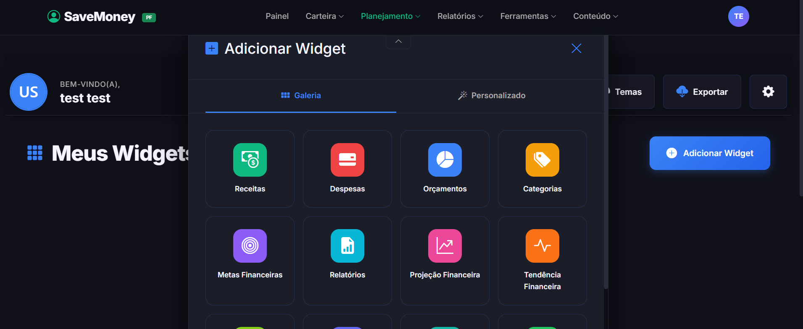   *(A imagem mostra várias opções de personalização)* |
---

## R11 - Avisos e Notificações
| **Caso de Teste** | **CT-R11-001 - Avisos** |
| :--- | :--- |
| **Requisito Associado** | **R11** - O sistema deve conter notificações com alertas de progresso e indicadores visuais. |
| **Resultado** | **[Aprovado** |
| **Registro de evidência** | 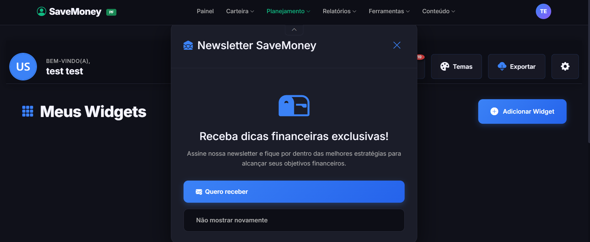   *(A imagem mostra um aviso)* |

| **Caso de Teste** | **CT-R11-002 - Notificações** |
| :--- | :--- |
| **Requisito Associado** | **R11** - O sistema deve conter notificações com alertas de progresso e indicadores visuais. |
| **Resultado** | **[Aprovado** |
| **Registro de evidência** |    *(A imagem mostra notificações e indicadores visuais)* |
---

## R12 - Gestão de Orçamento
| **Caso de Teste** | **CT-R12-001 - Criar Orçamento** |
| :--- | :--- |
| **Requisito Associado** | **R12** - Permitir o planejamento e controle de orçamentos, com definição de limites por categoria. |
| **Resultado** | **[Aprovado** |
| **Registro de evidência** | 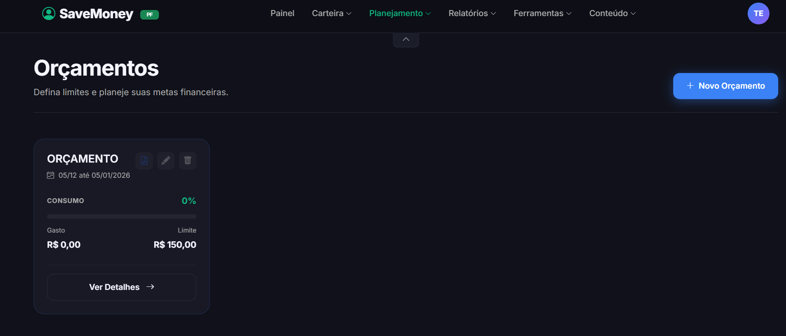   *(A imagem mostra um orçamento criado)* |

| **Caso de Teste** | **CT-R12-002 - Detalhes por categoria** |
| :--- | :--- |
| **Requisito Associado** | **R12** - Permitir o planejamento e controle de orçamentos, com definição de limites por categoria. |
| **Resultado** | **[Aprovado** |
| **Registro de evidência** | 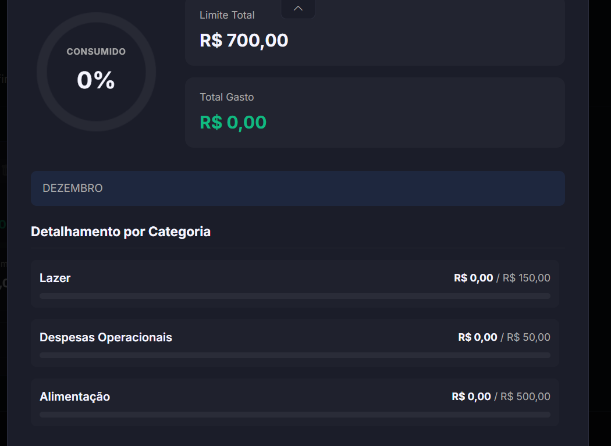   *(A imagem mostra detalhes do orçamento, as categorias com limites e opção para exportar, editar, excluir)* |
---

## R13 - Análise de Tendências
| **Caso de Teste** | **CT-R13-001 - Tendências Financeiras** |
| :--- | :--- |
| **Requisito Associado** | **R13** - O sistema deve conter análises de tendências financeiras. |
| **Resultado** | **[Aprovado** |
| **Registro de evidência** | 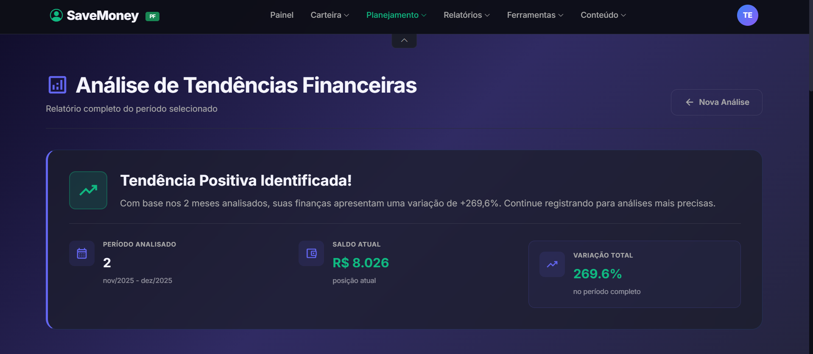   *(A imagem mostra tendencias financeiras)* |
---

## R14 - Projeção Financeira
| **Caso de Teste** | **CT-R14-001 - Projeção Financeira** |
| :--- | :--- |
| **Requisito Associado** | **R14** - O usuário deve consultar projeções financeiras futuras.|
| **Resultado** | **[Aprovado** |
| **Registro de evidência** | 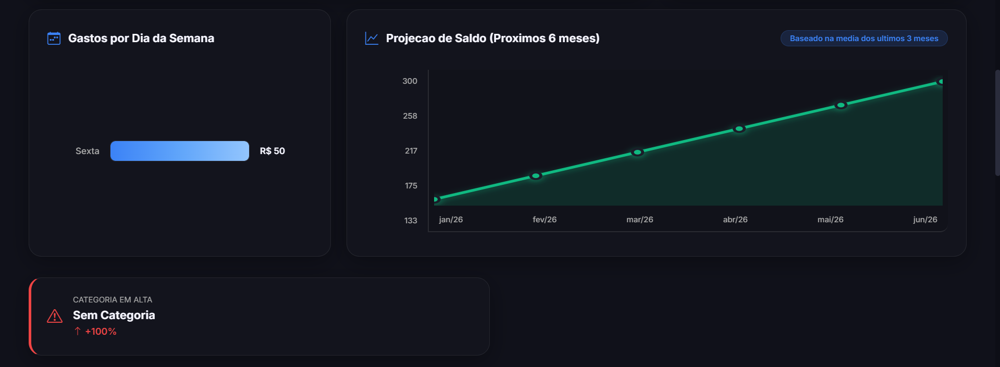   *(A imagem mostra projeções futuras)* |
---

## R15 - Ferramentas Interativas
| **Caso de Teste** | **CT-R15-001 - Calculador de Metas** |
| :--- | :--- |
| **Requisito Associado** | **R15** - Disponibilizar ferramentas interativas para auxílio no planejamento financeiro. |
| **Resultado** | **[Aprovado** |
| **Registro de evidência** | 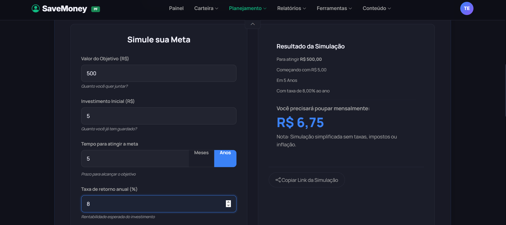   *(A imagem mostra uma ferramenta, calculadora de metas)* |

| **Caso de Teste** | **CT-R15-002 - Calculador de Juros Composto** |
| :--- | :--- |
| **Requisito Associado** | **R15** - Disponibilizar ferramentas interativas para auxílio no planejamento financeiro. |
| **Resultado** | **[Aprovado** |
| **Registro de evidência** | 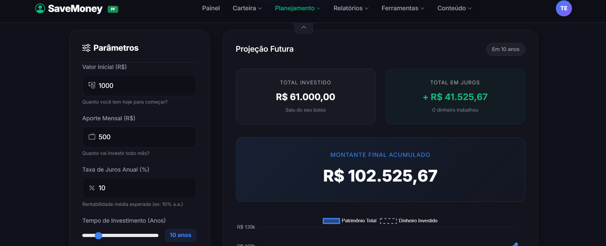   *(A imagem mostra uma ferramenta, calculador de juros composto)* |

| **Caso de Teste** | **CT-R15-003 - Calculador de Juros Composto Grafico** |
| :--- | :--- |
| **Requisito Associado** | **R15** - Disponibilizar ferramentas interativas para auxílio no planejamento financeiro. |
| **Resultado** | **[Aprovado** |
| **Registro de evidência** | 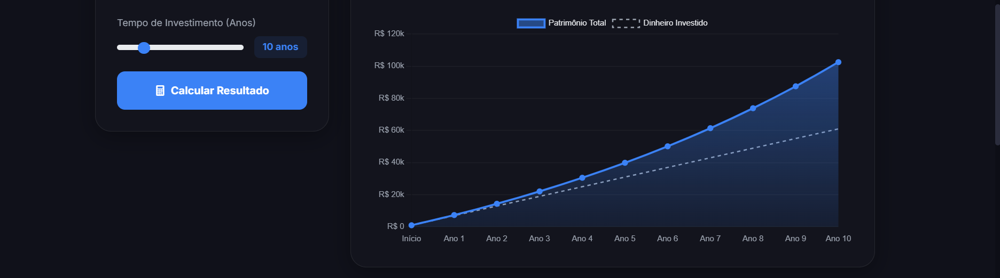   *(A imagem mostra uma ferramenta, calculadora de metas e resultado com grafico)* |
---

## R16 - Histórico Financeiro
| **Caso de Teste** | **CT-R16-001 - Informações Gerais** |
| :--- | :--- |
| **Requisito Associado** | **R16** -  O usuário poderá visualizar saldos e histórico financeiro. |
| **Resultado** | **[Aprovado** |
| **Registro de evidência** | 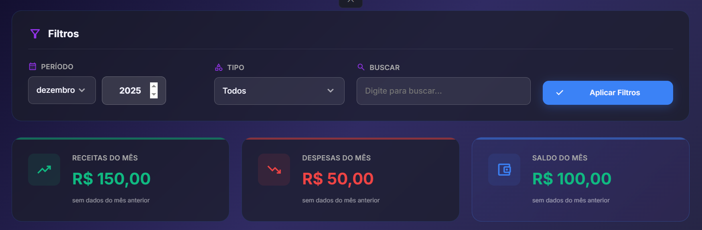   *(A imagem mostra informações gerais de transações financeiras)* |

| **Caso de Teste** | **CT-R16-002 - Evolução Financeira** |
| :--- | :--- |
| **Requisito Associado** | **R16** -  O usuário poderá visualizar saldos e histórico financeiro. |
| **Resultado** | **[Aprovado** |
| **Registro de evidência** | 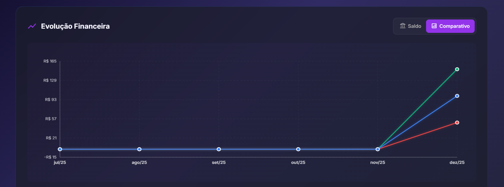   *(A imagem mostra grafico da evolução financeira)* |

| **Caso de Teste** | **CT-R16-003 - Movimentação Financeira** |
| :--- | :--- |
| **Requisito Associado** | **R16** -  O usuário poderá visualizar saldos e histórico financeiro. |
| **Resultado** | **[Aprovado** |
| **Registro de evidência** | 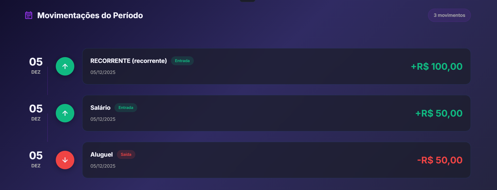   *(A imagem mostra as transações financeiras feitas)* |

### Relatório Específico do R1
**Timeline animada, gráfico de barras dos últimos 6 meses e exportação em PDF com QuestPDF funcionando perfeitamente. Responsivo testado em mobile.**
---

## Relatório Geral de Testes de Software

**Total de requisitos testados:** 16  
**Total de casos de teste executados:** 89+  
**Aprovados:** 100%  
**Reprovados:** 0

> **Links Úteis**:
> - [Ferramentas de Test para Java Script](https://geekflare.com/javascript-unit-testing/)
