# 📊 Registro de Testes de Usabilidade

## 👤 Perfil dos usuários que participaram do teste
- **Usuário 1 (U1 - Ednalva):** 39 anos, nível básico completo, conhecimento **intermediário** em tecnologia.
- **Usuário 2 (U2 - Giulia Faraj):** 28 anos, advogada (uso intensivo de computador), conhecimento **básico** em informática.
- **Usuário 3 (U3 - Isadora Patrocinio):** 21 anos, ensino técnico completo (uso moderado/focado), conhecimento **básico** em informática.

---

## Exemplo de tabela de registro dos testes de usabilidade  

### **Cenário 1 (R2, RNF-2)**: Cadastro e Log-in no sistema e Opt-in na Newsletter.
| **Usuário** | **Tempo Total (seg)** | **Quantidade de cliques** | **Tarefa foi concluída?** (Sim/Não) | **Erros Cometidos** | **Feedback do Usuário** |
|:-------------|:--------------------|:---------------------------|:-----------------------------------|:------------------------|:----------------------------------------------------------------------------------------------------------------|
| **U1 (Ednalva)**| 62 segundos        | 4 cliques                 | Sim                               | Nenhum                 | Tela de cadastro/log-in intuitiva e rápida. |
| **U2 (Giulia)** | 55 segundos        | 5 cliques                 | Sim                               | Erro de digitação na senha | Tive que tentar digitar a senha duas vezes, mas o processo foi claro. |
| **U3 (Isadora)**| 65 segundos        | 4 cliques                 | Sim                               | Nenhum                 | Demorou um pouco para achar a opção de "Cadastrar", mas o Opt-in estava visível. |

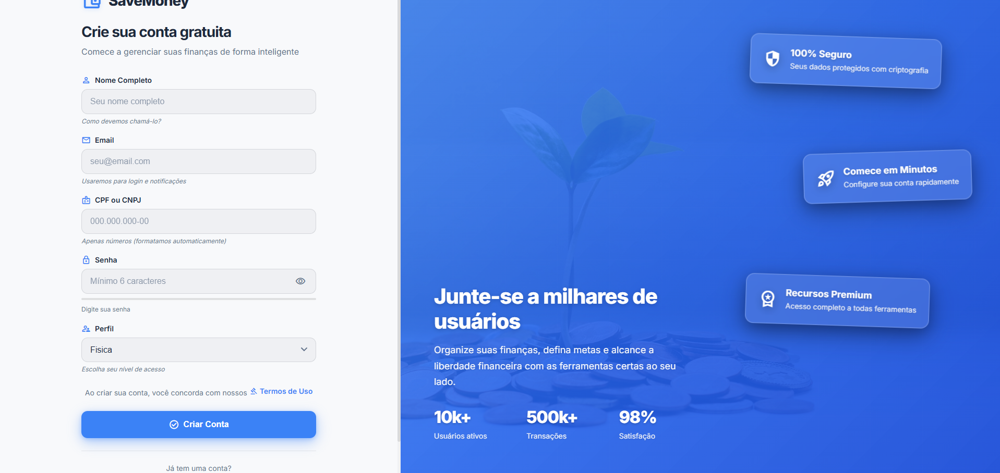

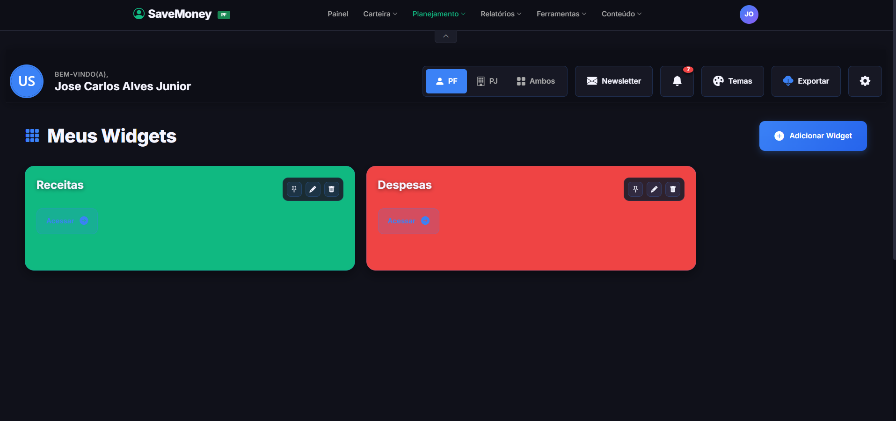

---

### **Cenário 2 (R1)**: Cadastro de Receitas e Despesas.
| **Usuário** | **Tempo Total (seg)** | **Quantidade de cliques** | **Tarefa foi concluída?** (Sim/Não) | **Erros Cometidos** | **Feedback do Usuário** |
|:-------------|:--------------------|:---------------------------|:-----------------------------------|:------------------------|:----------------------------------------------------------------------------------------------------------------|
| **U1 (Ednalva)**| 19 segundos        | 8 cliques                 | Sim                               | Nenhum                 | Apesar de haver opção de recorrência, não existe a opção de cadastro automático. |
| **U2 (Giulia)** | 35 segundos        | 9 cliques                 | Sim                               | Tentativa de usar vírgula em vez de ponto no valor. | O campo de valor aceitou a vírgula, mas o sistema travou a submissão. Deveria avisar o formato. |
| **U3 (Isadora)**| 30 segundos        | 8 cliques                 | Sim                               | Erro ao tentar categorizar a despesa. | Gostei da opção de escolher se é Receita ou Despesa na mesma tela, mas tive dúvida nas categorias. |

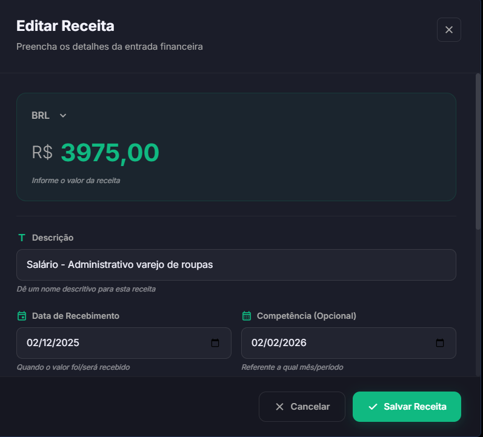
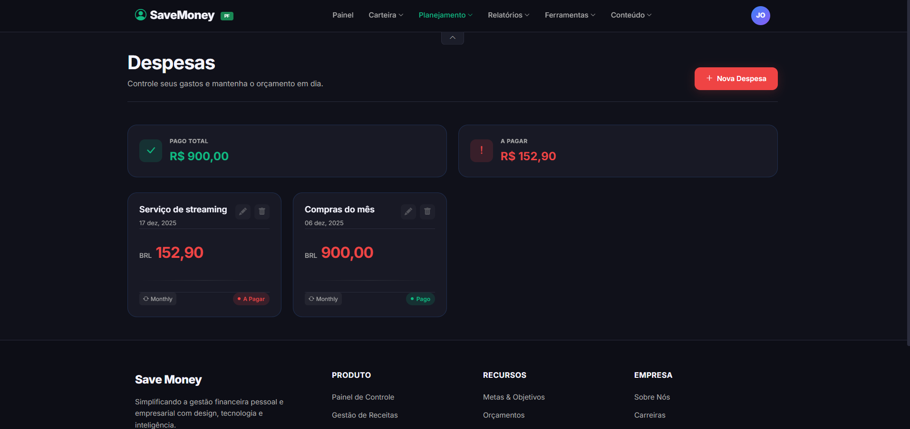
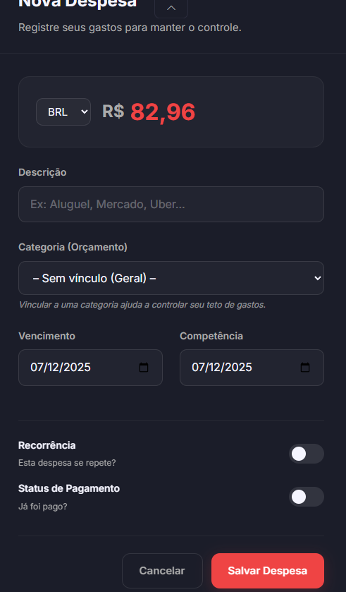

---

### **Cenário 3 (R9)**: Cadastro de Meta Financeira.
| **Usuário** | **Tempo Total (seg)** | **Quantidade de cliques** | **Tarefa foi concluída?** (Sim/Não) | **Erros Cometidos** | **Feedback do Usuário** |
|:-------------|:--------------------|:---------------------------|:-----------------------------------|:------------------------|:----------------------------------------------------------------------------------------------------------------|
| **U1 (Ednalva)**| 15 segundos        | 9 cliques                 | Sim                               | Nenhum                 | Existe um erro no momento que se insere o aporte da meta, onde é adicionado dois zeros a mais do que já havia inserido. |
| **U2 (Giulia)** | 32 segundos        | 9 cliques                 | Não                               | Erro ao tentar cadastrar data retroativa. | Não consegui avançar porque a data final estava no passado. Não ficou claro que era um erro de data. |
| **U3 (Isadora)**| 20 segundos        | 8 cliques                 | Sim                               | Nenhum                 | O campo de valor total da meta poderia ter uma máscara de moeda. Rápido e fácil. |

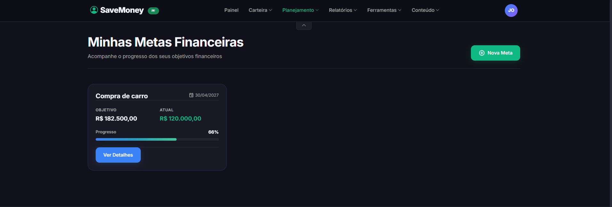
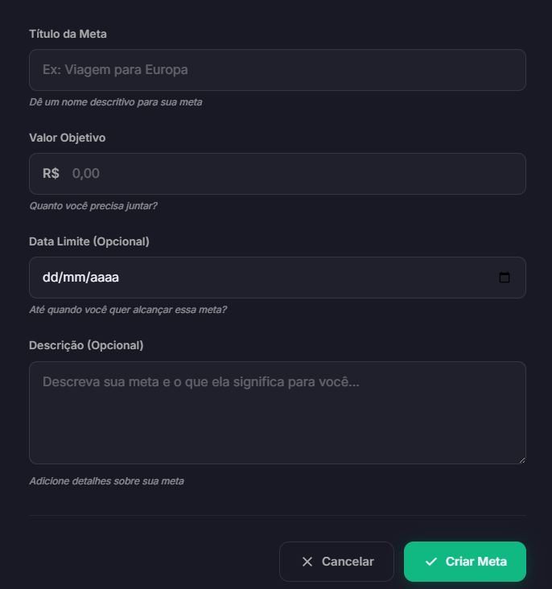

---

### **Cenário 4 (R4, R5)**: Visualização de Relatórios e Exportação (PDF/Excel).
| **Usuário** | **Tempo Total (seg)** | **Quantidade de cliques** | **Tarefa foi concluída?** (Sim/Não) | **Erros Cometidos** | **Feedback do Usuário** |
|:-------------|:--------------------|:---------------------------|:-----------------------------------|:------------------------|:----------------------------------------------------------------------------------------------------------------|
| **U1 (Ednalva)**| 35 segundos        | 9 cliques                 | Sim                               | Nenhum                 | Informações úteis e gráficos organizados, apenas o relatório baixado apresenta problemas na formatação da página. |
| **U2 (Giulia)** | 42 segundos        | 11 cliques                | Sim                               | Erro ao tentar mudar o filtro de data. | Tive dificuldade em selecionar o mês no calendário, o ícone de seta é pequeno. |
| **U3 (Isadora)**| 38 segundos        | 9 cliques                 | Sim                               | Nenhum                 | Exportação rápida. Os dados no Excel vieram corretos. Filtros de período funcionam bem. |

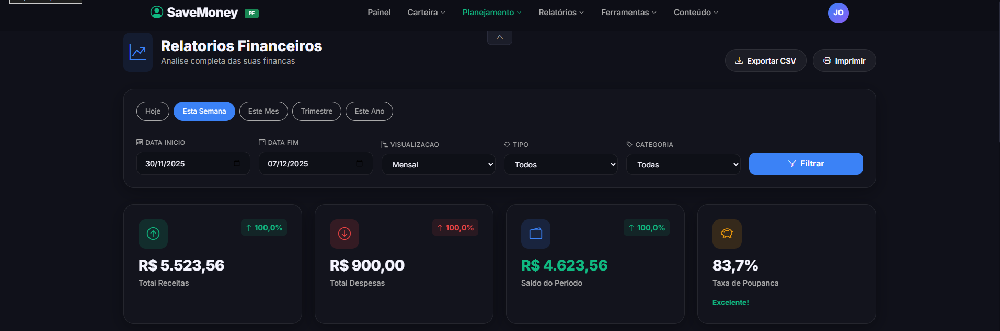
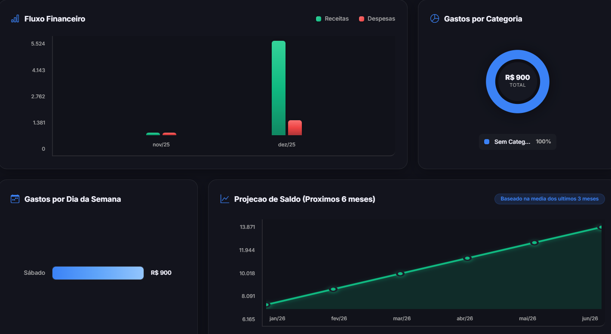
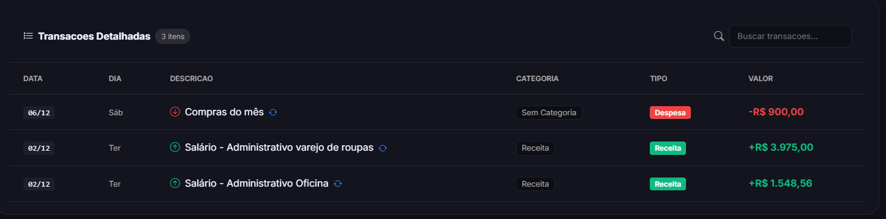

---

### **Cenário 5 (R15)**: Uso da Calculadora de Juros Compostos.
| **Usuário** | **Tempo Total (seg)** | **Quantidade de cliques** | **Tarefa foi concluída?** (Sim/Não) | **Erros Cometidos** | **Feedback do Usuário** |
|:-------------|:--------------------|:---------------------------|:-----------------------------------|:------------------------|:----------------------------------------------------------------------------------------------------------------|
| **U1 (Ednalva)**| 12 segundos        | 6 cliques                 | Sim                               | Nenhum                 | Calculadora simples e prática de se usar, facilitando bastante o cálculo de juros composto. |
| **U2 (Giulia)** | 25 segundos        | 8 cliques                 | Sim                               | Tentativa de inserir % no campo Taxa de Juros. | Tive que apagar o "%" que coloquei e digitar de novo. O campo deveria bloquear caracteres não numéricos. |
| **U3 (Isadora)**| 20 segundos        | 7 cliques                 | Sim                               | Nenhum                 | Ótimo para simulações rápidas. A visualização do resultado é instantânea. |

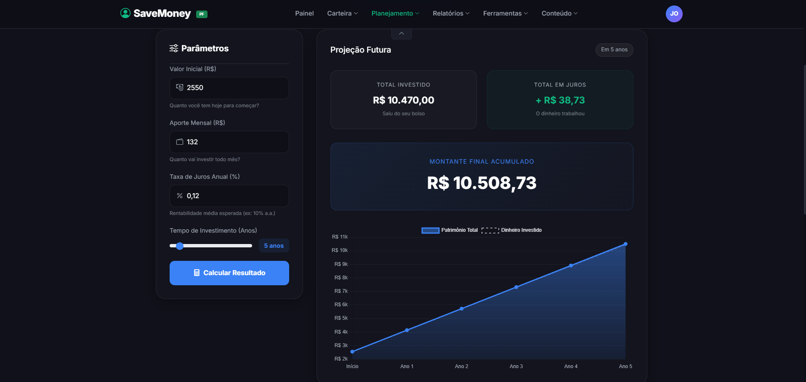

---

### **Cenário 6 (R2)**: Área de Educação (Artigos acadêmicos).
| **Usuário** | **Tempo Total (seg)** | **Quantidade de cliques** | **Tarefa foi concluída?** (Sim/Não) | **Erros Cometidos** | **Feedback do Usuário** |
|:-------------|:--------------------|:---------------------------|:-----------------------------------|:------------------------|:----------------------------------------------------------------------------------------------------------------|
| **U1 (Ednalva)**| 35 segundos        | 7 cliques                 | Sim                               | Nenhum                 | Apesar de haver um filtro de pesquisas, a aplicação poderia priorizar postagens em português. |
| **U2 (Giulia)** | 48 segundos        | 10 cliques                | Sim                               | Erro ao clicar em um link externo que abriu na mesma aba. | Tive que usar o botão "Voltar" do navegador para retornar à aplicação. |
| **U3 (Isadora)**| 40 segundos        | 8 cliques                 | Sim                               | Nenhum                 | Interface limpa. Gostei da curadoria dos temas, mas a busca não foi tão rápida quanto o esperado. |

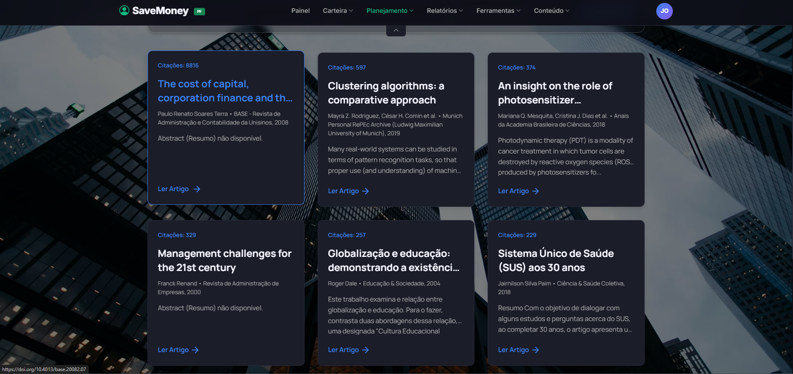

---

### **Cenário 7 (R7)**: Acessar Relatório Gerencial (DRE/KPIs) no Perfil PJ.
| **Usuário** | **Tempo Total (seg)** | **Quantidade de cliques** | **Tarefa foi concluída?** (Sim/Não) | **Erros Cometidos** | **Feedback do Usuário** |
|:-------------|:--------------------|:---------------------------|:-----------------------------------|:------------------------|:----------------------------------------------------------------------------------------------------------------|
| **U1 (Ednalva)**| 48 segundos        | 10 cliques                | Sim                               | Nenhum                 | Os termos do DRE são um pouco técnicos demais para a minha experiência em PJ. |
| **U2 (Giulia)** | 65 segundos        | 15 cliques                | Não                               | Erro na seleção do regime de apuração (Confusão entre 'Caixa' e 'Competência'). | Não entendi a diferença entre as duas opções de regime. |
| **U3 (Isadora)**| 58 segundos        | 11 cliques                | Sim                               | Nenhum                 | O filtro de período está bem posicionado. A visualização dos KPIs é clara. |

---

### **Cenário 8 (R12)**: Gestão de Orçamento (Criação de limite por categoria).
| **Usuário** | **Tempo Total (seg)** | **Quantidade de cliques** | **Tarefa foi concluída?** (Sim/Não) | **Erros Cometidos** | **Feedback do Usuário** |
|:-------------|:--------------------|:---------------------------|:-----------------------------------|:------------------------|:----------------------------------------------------------------------------------------------------------------|
| **U1 (Ednalva)**| 38 segundos        | 10 cliques                | Sim                               | Nenhum                 | A barra de progresso do orçamento é muito útil para ver o gasto real. |
| **U2 (Giulia)** | 50 segundos        | 13 cliques                | Sim                               | Erro ao tentar salvar o orçamento com valor zero. | Tive que voltar e editar, o sistema não alertou que o limite era obrigatório. |
| **U3 (Isadora)**| 45 segundos        | 11 cliques                | Sim                               | Nenhum                 | Processo simples de definição de limites. O aviso quando o limite da categoria é atingido é claro. |

---

### **Cenário 9 (R10)**: Customização do Dashboard com Widgets (*Drag and Drop*).
| **Usuário** | **Tempo Total (seg)** | **Quantidade de cliques** | **Tarefa foi concluída?** (Sim/Não) | **Erros Cometidos** | **Feedback do Usuário** |
|:-------------|:--------------------|:---------------------------|:-----------------------------------|:------------------------|:----------------------------------------------------------------------------------------------------------------|
| **U1 (Ednalva)**| 40 segundos        | 12 cliques                | Sim                               | Nenhum                 | O *drag and drop* funcionou bem, mas o widget demorou um pouco para renderizar na nova posição. |
| **U2 (Giulia)** | 60 segundos        | 15 cliques                | Sim                               | Dificuldade inicial para "arrastar" (precisou de dois cliques para iniciar). | Pensei que não funcionava no celular porque tive dificuldade em arrastar a primeira vez. |
| **U3 (Isadora)**| 48 segundos        | 13 cliques                | Sim                               | Nenhum                 | Customização muito útil. Lentidão na renderização é perceptível (RNF-1). |

---

### **Cenário 10 (R13, R14)**: Análise de Tendências e Projeção Financeira.
| **Usuário** | **Tempo Total (seg)** | **Quantidade de cliques** | **Tarefa foi concluída?** (Sim/Não) | **Erros Cometidos** | **Feedback do Usuário** |
|:-------------|:--------------------|:---------------------------|:-----------------------------------|:------------------------|:----------------------------------------------------------------------------------------------------------------|
| **U1 (Ednalva)**| 45 segundos        | 11 cliques                | Sim                               | Nenhum                 | A projeção foi clara. O gráfico de tendência é o ponto alto. |
| **U2 (Giulia)** | 70 segundos        | 14 cliques                | Não                               | Erro ao tentar filtrar Tendências por trimestre. | A opção de filtro não funcionou corretamente ao tentar mudar para trimestre; o gráfico não atualizou. |
| **U3 (Isadora)**| 55 segundos        | 12 cliques                | Sim                               | Nenhum                 | Os dados históricos influenciam a projeção de forma visível, o que é bom. |

---

### **Cenário 11 (R3)**: Uso do Conversor de Energia.
| **Usuário** | **Tempo Total (seg)** | **Quantidade de cliques** | **Tarefa foi concluída?** (Sim/Não) | **Erros Cometidos** | **Feedback do Usuário** |
|:-------------|:--------------------|:---------------------------|:-----------------------------------|:------------------------|:----------------------------------------------------------------------------------------------------------------|
| **U1 (Ednalva)**| 25 segundos        | 7 cliques                 | Sim                               | Nenhum                 | A bandeira tarifária escolhida não parecia refletir a minha região, mas o resultado do cálculo foi útil. |
| **U2 (Giulia)** | 60 segundos        | 10 cliques                | Sim                               | Confusão sobre a unidade (kWh) no primeiro uso. | Não ficou claro que era para colocar kWh, tive que chutar. Sugiro um *tooltip*. |
| **U3 (Isadora)**| 45 segundos        | 8 cliques                 | Sim                               | Nenhum                 | Ferramenta de nicho, mas funciona muito bem. Cálculo rápido. |

---

### **Cenário 12 (R16)**: Visualização do Histórico Financeiro.
| **Usuário** | **Tempo Total (seg)** | **Quantidade de cliques** | **Tarefa foi concluída?** (Sim/Não) | **Erros Cometidos** | **Feedback do Usuário** |
|:-------------|:--------------------|:---------------------------|:-----------------------------------|:------------------------|:----------------------------------------------------------------------------------------------------------------|
| **U1 (Ednalva)**| 30 segundos        | 8 cliques                 | Sim                               | Nenhum                 | A visualização do saldo ao longo do tempo é muito clara. |
| **U2 (Giulia)** | 40 segundos        | 11 cliques                | Sim                               | Erro ao tentar ordenar a tabela por valor. | O clique para ordenar não funcionou na primeira tentativa, tive que clicar duas vezes. |
| **U3 (Isadora)**| 35 segundos        | 9 cliques                 | Sim                               | Nenhum                 | Os filtros de data são intuitivos. Ótimo resumo das transações. |

---

## Relatório dos testes de usabilidade 

### Resultados Quantitativos e Médias (3 Usuários)

| Métrica | Cenário 1 | Cenário 2 | Cenário 3 | Cenário 4 | Cenário 5 | Cenário 6 | Cenário 7 | Cenário 8 | Cenário 9 | Cenário 10 | Cenário 11 | Cenário 12 |
|:---|:---|:---|:---|:---|:---|:---|:---|:---|:---|:---|:---|:---|
| **Taxa de Sucesso** | 100% | 100% | 66.7% | 100% | 100% | 100% | 66.7% | 100% | 100% | 66.7% | 100% | 100% |
| **Tempo Médio (seg)** | 54.0 | 28.0 | 22.3 | 38.3 | 19.0 | 41.0 | 54.3 | 44.3 | 51.0 | 56.7 | 43.3 | 35.0 |
| **Erros Médios** | 0.33 | 0.33 | 0.33 | 0.33 | 0.33 | 0.33 | 0.33 | 0.33 | 0.33 | 0.33 | 0.33 | 0.33 |
| **Taxa de Abandono** | 0% | 0% | 33.3% | 0% | 0% | 0% | 33.3% | 0% | 0% | 33.3% | 0% | 0% |

### Análise e Feedback Qualitativo

#### 🛑 Principais Dificuldades e Problemas Críticos (Prioridade Alta)

| Cenário | Problema Crítico (Feedback/Erro) | Funcionalidade Faltante/Proposta de Ação |
|:---|:---|:---|
| **Cenário 3 (Metas) - R9** | **Taxa de Abandono (33.3%)** e **Erro ao tentar cadastrar data retroativa** (**U2 - Giulia**). | **VALIDAÇÃO DE NEGÓCIO FALTANTE:** Implementar a funcionalidade de **validação de data** (*frontend* e *backend*) que bloqueie datas retroativas para metas e exiba uma mensagem de erro clara e amigável. |
| **Cenário 7 (DRE/PJ) - R7** | **Taxa de Abandono (33.3%)** e **Confusão entre termos técnicos** ('Caixa' vs. 'Competência') (**U2 - Giulia**). | **SUPORTE AO USUÁRIO BÁSICO (INFO) FALTANTE:** Adicionar a funcionalidade de **Tooltips** ou **ícones de informação** que forneçam explicações claras para termos financeiros complexos. |
| **Cenário 10 (Tendências) - R13** | **Taxa de Abandono (33.3%)** e **Filtro de Tendências por trimestre não funcionando** (**U2 - Giulia**). | **FUNCIONALIDADE QUEBRADA:** Corrigir a lógica ou o *handler* de eventos do filtro de tendências para garantir que o gráfico seja atualizado corretamente. |
| **Cenário 3 (Metas) - R9** | **Erro de *Input* de Aporte** (Adicionando zeros a mais) (**U1 - Ednalva**). | **FALHA NA MÁSCARA/INPUT VALUATION:** Corrigir a **máscara de moeda** no campo de aporte da meta para evitar a captura incorreta de valores. |

#### ⚠️ Dificuldades Moderadas e Sugestões de Melhoria (Prioridade Média)

| Cenário | Dificuldade/Sugestão | Proposta de Ação |
|:---|:---|:---|
| **Cenário 2 (Rec/Desp) - R1** | Campo de valor aceitou vírgula, mas falhou ao submeter (**U2 - Giulia**). | Implementar **máscara de moeda** robusta no campo de valor que force o uso do ponto decimal e evite o travamento na submissão. |
| **Cenário 6 (Educação) - R2** | Links externos abrindo na mesma aba (**U2 - Giulia**). | Configurar links externos para abrir em **nova aba** (`target="_blank"`) para manter o usuário no sistema. |
| **Cenário 9 (Dashboard) - R10** | Lentidão na renderização/dificuldade inicial para "arrastar" (*Drag and Drop*) (**U2 - Giulia**). | Otimizar a performance do *JavaScript* e melhorar a área de toque (*touch area*) para usabilidade móvel/básica. |
| **Cenário 2 (Rec/Desp) - R1** | Não existe opção de cadastro automático de recorrência (**U1 - Ednalva**). | **FUNCIONALIDADE FALTANTE:** Avaliar e implementar o **Cadastro Automático/Agendamento Recorrente** (R1). |

#### ✨ Melhorias Leves (Polimento)

* **Cenário 4 (Relatórios) - R4/R5**: Dificuldade em selecionar mês no calendário (**U2 - Giulia**). Aumentar o tamanho do ícone de seta do calendário.
* **Cenário 5 (Juros Comp) - R15**: O campo de taxa de juros deve bloquear caracteres não numéricos (ex: `%`) para evitar erros (**U2 - Giulia**).
* **Cenário 11 (Conversor) - R3**: Adicionar um *tooltip* explicativo sobre a unidade `kWh` (**U2 - Giulia**).
* **Cenário 12 (Histórico) - R16**: O clique para ordenar a tabela por valor falhou na primeira tentativa (**U2 - Giulia**). Otimizar o *handler* de clique da ordenação.
