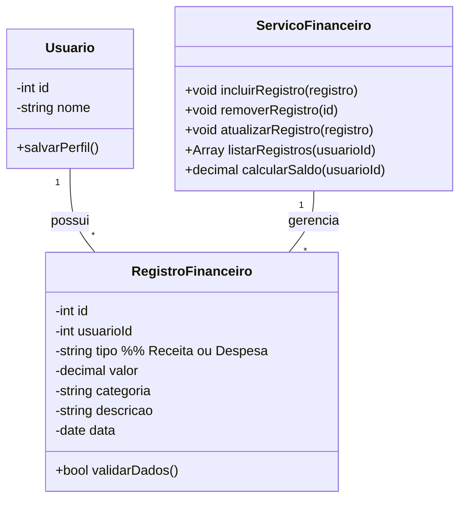

# Arquitetura da Solução — R1 Controle Financeiro

## 1. Introdução

Este documento detalha a arquitetura da solução para o requisito R1 - Controle Financeiro, permitindo que o usuário registre receitas e despesas, com foco em sua implementação completa, incluindo backend e persistência.


## 2. Diagrama de Classes




## 3. Modelos de Dados

### 3.1 Modelo Entidade Relacionamento (Conceitual)

**Entidades:**

- **Usuário:** `cod_usuario`, `nome`
- **RegistroFinanceiro:** `cod_registro`, `cod_usuario`, `tipo` (Receita/Despesa), `valor`, `categoria`, `descricao`, `data`

**Relacionamentos:**

- Usuário 1:N RegistroFinanceiro

### 3.2 Projeto da Base de Dados (Esquema Lógico)

```sql
-- Tabela para armazenar informações dos usuários
CREATE TABLE Usuario (
    cod_usuario INT PRIMARY KEY AUTO_INCREMENT,
    nome VARCHAR(255) NOT NULL
);

-- Tabela para armazenar receitas e despesas
CREATE TABLE RegistroFinanceiro (
    cod_registro INT PRIMARY KEY AUTO_INCREMENT,
    cod_usuario INT NOT NULL,
    tipo ENUM('Receita', 'Despesa') NOT NULL,
    valor DECIMAL(10, 2) NOT NULL,
    categoria VARCHAR(100),
    descricao TEXT,
    data DATE NOT NULL,
    FOREIGN KEY (cod_usuario) REFERENCES Usuario(cod_usuario)
);
```


## 4. Implementação de Métodos

### 4.1 Lógica dos Métodos da Classe RegistroFinanceiro

**validarDados()**

- Verifica se `valor` é um número válido e maior que zero.
- Verifica se `tipo` está entre as opções permitidas ("Receita", "Despesa").
- Verifica se `data` está preenchida e é válida.
- Retorna `true` se todos os dados são válidos, `false` caso contrário.

### 4.2 Lógica dos Métodos do Serviço Financeiro

**incluirRegistro()**
1. Recebe uma instância de RegistroFinanceiro.
2. Valida os dados.
3. Insere o registro no banco de dados.
4. Retorna confirmação de inclusão.

**removerRegistro()**
1. Remove o registro do banco de dados pelo id.

**atualizarRegistro()**
1. Valida os dados recebidos.
2. Atualiza o registro existente no banco de dados.

**listarRegistros()**
1. Busca todos os registros financeiros do usuário.
2. Retorna a lista de receitas e despesas.

**calcularSaldo()**
1. Calcula o saldo do usuário somando todas as receitas e subtraindo todas as despesas.
2. Retorna o saldo atual.

