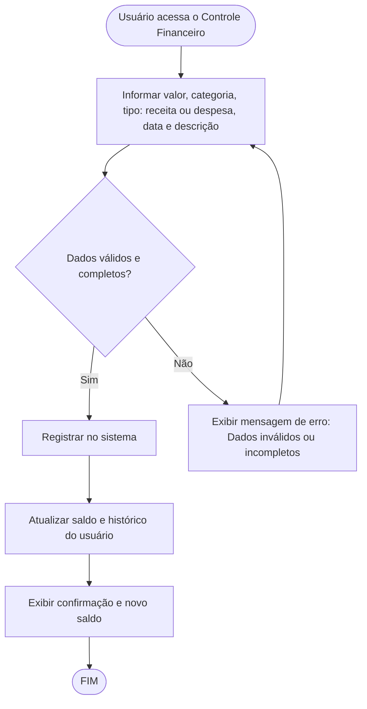

# Projeto de Interface — R1 Controle Financeiro

## 1. Modelos Funcionais

### 1.1 Diagrama de Fluxo (Fluxograma)

Este diagrama representa o fluxo de execução para a funcionalidade de registro de receitas e despesas, desde a entrada de dados do usuário até a confirmação do registro e atualização do saldo.

## 2. Protótipos de Telas

- Tela de Cadastro de Receita/Despesa: Campos para valor, categoria, tipo, data e descrição, botão de salvar.
- Tela de Listagem: Exibe histórico de registros financeiros, filtros por período, categoria e tipo.
- Tela de Saldo: Mostra saldo atual, total de receitas e despesas.

## 3. Navegação

- O usuário pode acessar o cadastro a partir do menu principal.
- Após o registro, retorna à tela de listagem com atualização automática.
- Opção de editar ou remover registros existentes.
