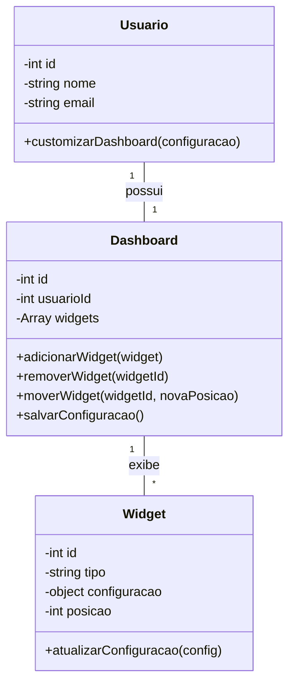

# Arquitetura da Solução — R10 Dashboard Personalizado

## 1. Introdução

Este documento detalha a arquitetura da solução para o requisito R10 — Dashboard Personalizado, que permite ao usuário customizar seu painel financeiro com widgets configuráveis e função drag and drop.

## 2. Diagrama de Classes



## 3. Modelos de Dados

### 3.1 Modelo Entidade Relacionamento (Conceitual)

**Entidades:**

- **Usuário:** `cod_usuario`, `nome`, `email`
- **Dashboard:** `cod_dashboard`, `cod_usuario`, `configuracao_json`
- **Widget:** `cod_widget`, `cod_dashboard`, `tipo_widget`, `configuracao_json`, `posicao`

**Relacionamentos:**

- Usuário 1:1 Dashboard
- Dashboard 1:N Widget

### 3.2 Projeto da Base de Dados (Esquema Lógico)

```sql
-- Tabela para armazenar informações dos usuários
CREATE TABLE Usuario (
    cod_usuario INT PRIMARY KEY AUTO_INCREMENT,
    nome VARCHAR(255) NOT NULL,
    email VARCHAR(255) NOT NULL UNIQUE
);

-- Tabela para armazenar dashboards personalizados dos usuários
CREATE TABLE Dashboard (
    cod_dashboard INT PRIMARY KEY AUTO_INCREMENT,
    cod_usuario INT NOT NULL,
    configuracao_json JSON NOT NULL, -- Estrutura dos widgets, ordem, layout, etc.
    FOREIGN KEY (cod_usuario) REFERENCES Usuario(cod_usuario),
    UNIQUE (cod_usuario)
);

-- Tabela para armazenar widgets do dashboard
CREATE TABLE Widget (
    cod_widget INT PRIMARY KEY AUTO_INCREMENT,
    cod_dashboard INT NOT NULL,
    tipo_widget VARCHAR(50) NOT NULL, -- Ex: "grafico", "tabela", "dica", "resumo"
    configuracao_json JSON NOT NULL, -- Configurações específicas do widget
    posicao INT NOT NULL, -- Ordem/posição do widget no dashboard
    FOREIGN KEY (cod_dashboard) REFERENCES Dashboard(cod_dashboard)
);
```

## 4. Implementação de Métodos

### 4.1 Lógica dos Métodos do Dashboard Personalizado

**customizarDashboard(configuracao)**

- Permite ao usuário definir a disposição, tipos e configurações dos widgets do seu painel financeiro.
- Salva a configuração no banco de dados, associada ao usuário.

**adicionarWidget(widget)**

- Adiciona um novo widget ao dashboard do usuário.
- Atualiza a configuração e salva.

**removerWidget(widgetId)**

- Remove um widget do dashboard pelo identificador.
- Atualiza a configuração e salva.

**moverWidget(widgetId, novaPosicao)**

- Permite ao usuário reorganizar a ordem dos widgets via drag and drop.
- Atualiza a posição do widget e salva a nova ordem.

**atualizarConfiguracao(config)** (na classe Widget)

- Permite alterar as configurações específicas de cada widget (ex: tipo de gráfico, filtros, cores, etc).

**salvarConfiguracao()**

- Persiste a configuração atual do dashboard e widgets no banco de dados.

**Observação:**
O dashboard personalizado permite ao usuário:

- Adicionar, remover e reordenar widgets (drag and drop).
- Configurar cada widget (tipo, dados exibidos, visualização).
- Salvar e restaurar layouts personalizados.

---
