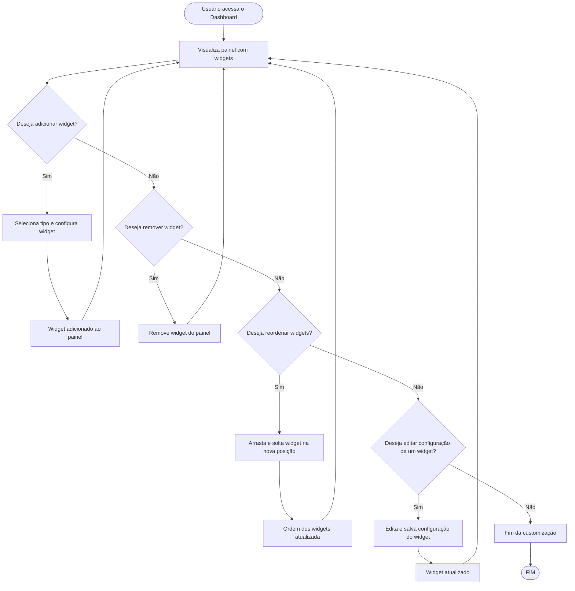

# Projeto de Interface — R10 Dashboard Personalizado

## 1. Modelos Funcionais

### 1.1 Diagrama de Fluxo (Fluxograma)

Este diagrama representa o fluxo de customização do dashboard financeiro, incluindo adição, remoção, configuração e reordenação (drag and drop) de widgets.

