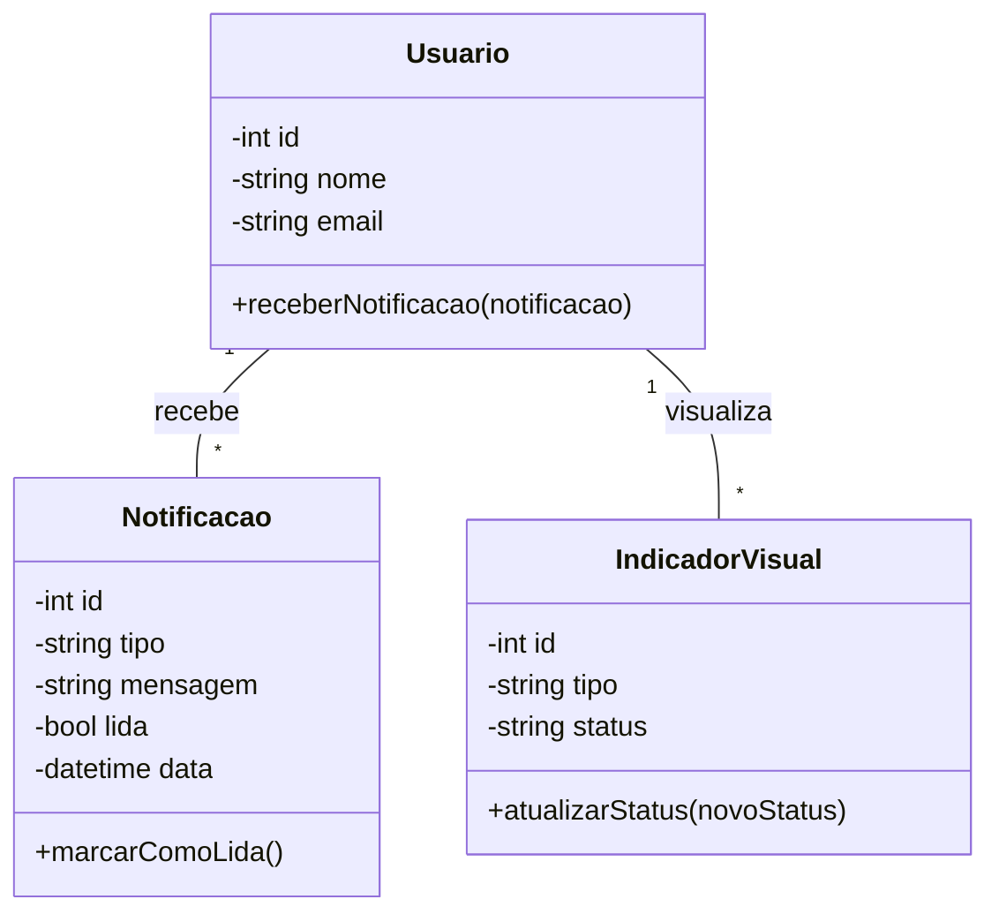

# Arquitetura da Solução — R11 Avisos e Notificações

## 1. Introdução

Este documento detalha a arquitetura da solução para o requisito R11 — Avisos e Notificações, que provê alertas de progresso e indicadores visuais para o usuário.

## 2. Diagrama de Classes



## 3. Modelos de Dados

### 3.1 Modelo Entidade Relacionamento (Conceitual)

**Entidades:**

- **Usuário:** `cod_usuario`, `nome`, `email`
- **Notificação:** `cod_notificacao`, `cod_usuario`, `tipo`, `mensagem`, `lida`, `data`
- **IndicadorVisual:** `cod_indicador`, `cod_usuario`, `tipo`, `status`

**Relacionamentos:**

- Usuário 1:N Notificação
- Usuário 1:N IndicadorVisual

### 3.2 Projeto da Base de Dados (Esquema Lógico)

```sql
-- Tabela para armazenar informações dos usuários
CREATE TABLE Usuario (
    cod_usuario INT PRIMARY KEY AUTO_INCREMENT,
    nome VARCHAR(255) NOT NULL,
    email VARCHAR(255) NOT NULL UNIQUE
);

-- Tabela para armazenar notificações dos usuários
CREATE TABLE Notificacao (
    cod_notificacao INT PRIMARY KEY AUTO_INCREMENT,
    cod_usuario INT NOT NULL,
    tipo VARCHAR(50) NOT NULL, -- Ex: "progresso", "lembrete", "conquista"
    mensagem TEXT NOT NULL,
    lida BOOLEAN DEFAULT FALSE,
    data DATETIME NOT NULL,
    FOREIGN KEY (cod_usuario) REFERENCES Usuario(cod_usuario)
);

-- Tabela para armazenar indicadores visuais
CREATE TABLE IndicadorVisual (
    cod_indicador INT PRIMARY KEY AUTO_INCREMENT,
    cod_usuario INT NOT NULL,
    tipo VARCHAR(50) NOT NULL, -- Ex: "badge", "barra", "alerta"
    status VARCHAR(50) NOT NULL, -- Ex: "ativo", "inativo", "pendente"
    FOREIGN KEY (cod_usuario) REFERENCES Usuario(cod_usuario)
);
```

## 4. Implementação de Métodos

### 4.1 Lógica dos Métodos de Avisos e Notificações

**receberNotificacao(notificacao)**
- Permite ao usuário receber uma nova notificação.
- Armazena a notificação no banco de dados.

**marcarComoLida()** (na classe Notificacao)
- Permite marcar uma notificação como lida.
- Atualiza o status no banco de dados.

**atualizarStatus(novoStatus)** (na classe IndicadorVisual)
- Permite atualizar o status de um indicador visual (ex: progresso, alerta).
- Persiste a alteração no banco de dados.

**Observação:**
O sistema de avisos e notificações permite ao usuário:
- Receber alertas de progresso, lembretes e conquistas.
- Visualizar indicadores visuais de status.
- Marcar notificações como lidas.
- Manter histórico de notificações e indicadores.

---
