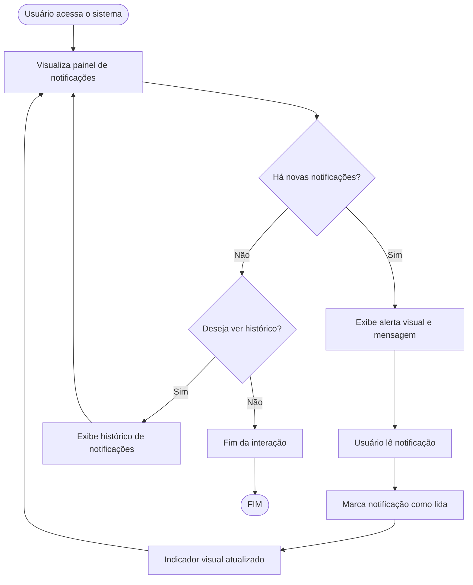

# Projeto de Interface — R11 Avisos e Notificações

## 1. Modelos Funcionais

### 1.1 Diagrama de Fluxo (Fluxograma)

Este diagrama representa o fluxo de exibição e interação com avisos e notificações, incluindo visualização, marcação como lida e atualização de indicadores visuais.

