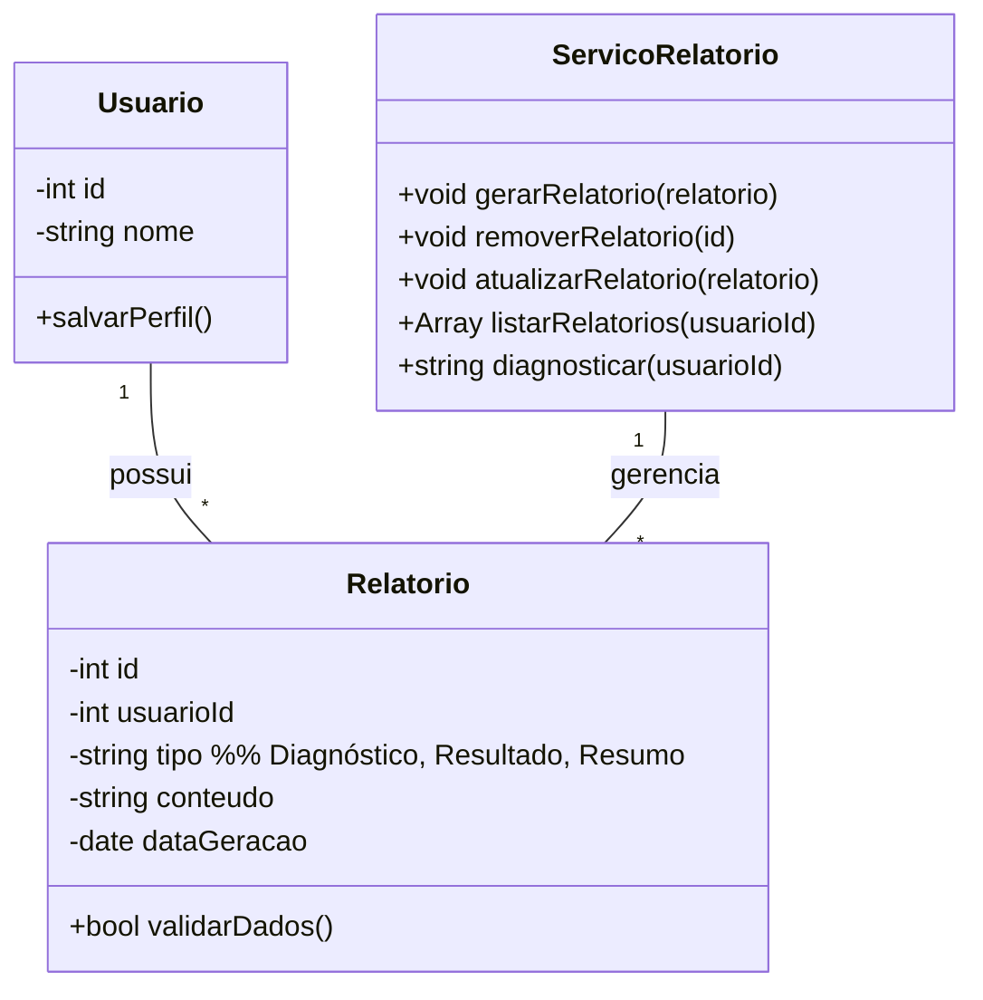

# Arquitetura da Solução — R4 Relatórios, Diagnósticos e Resultados

## 1. Introdução

Este documento detalha a arquitetura da solução para o requisito R4 - Relatórios, Diagnósticos e Resultados, permitindo que o usuário gere relatórios detalhados a partir dos dados financeiros, com backend e persistência.

## 2. Diagrama de Classes



## 3. Modelos de Dados

### 3.1 Modelo Entidade Relacionamento (Conceitual)

**Entidades:**

- **Usuário:** `cod_usuario`, `nome`
- **Relatorio:** `cod_relatorio`, `cod_usuario`, `tipo` (Diagnóstico/Resultado/Resumo), `conteudo`, `data_geracao`

**Relacionamentos:**

- Usuário 1:N Relatorio

### 3.2 Projeto da Base de Dados (Esquema Lógico)

```sql
-- Tabela para armazenar informações dos usuários
CREATE TABLE Usuario (
    cod_usuario INT PRIMARY KEY AUTO_INCREMENT,
    nome VARCHAR(255) NOT NULL
);

-- Tabela para armazenar relatórios
CREATE TABLE Relatorio (
    cod_relatorio INT PRIMARY KEY AUTO_INCREMENT,
    cod_usuario INT NOT NULL,
    tipo ENUM('Diagnóstico', 'Resultado', 'Resumo') NOT NULL,
    conteudo TEXT NOT NULL,
    data_geracao DATE NOT NULL,
    FOREIGN KEY (cod_usuario) REFERENCES Usuario(cod_usuario)
);
```

## 4. Implementação de Métodos

### 4.1 Lógica dos Métodos da Classe Relatorio

**validarDados()**

- Verifica se `conteudo` não está vazio.
- Verifica se `tipo` está entre as opções permitidas ("Diagnóstico", "Resultado", "Resumo").
- Verifica se `dataGeracao` está preenchida e é válida.
- Retorna `true` se todos os dados são válidos, `false` caso contrário.

### 4.2 Lógica dos Métodos do Serviço Relatório

**gerarRelatorio()**
1. Recebe uma instância de Relatorio.
2. Valida os dados.
3. Insere o relatório no banco de dados.
4. Retorna confirmação de geração.

**removerRelatorio()**
1. Remove o relatório do banco de dados pelo id.

**atualizarRelatorio()**
1. Valida os dados recebidos.
2. Atualiza o relatório existente no banco de dados.

**listarRelatorios()**
1. Busca todos os relatórios do usuário.
2. Retorna a lista de relatórios.

**diagnosticar()**
1. Analisa os dados financeiros do usuário e gera um diagnóstico.
2. Retorna o diagnóstico gerado.

