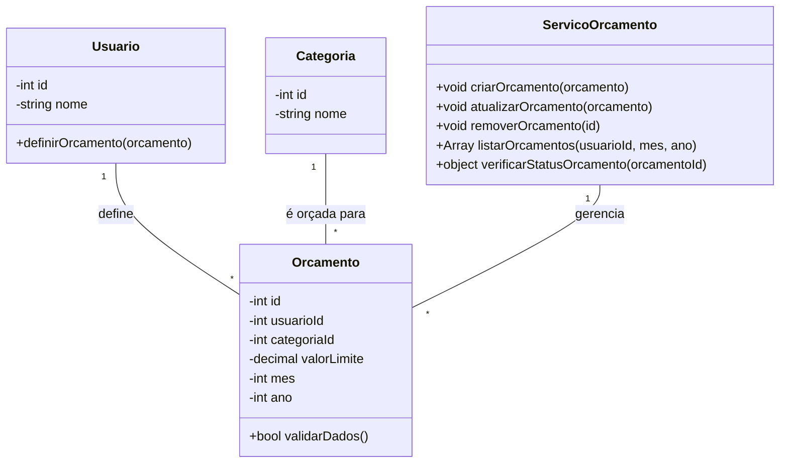

# Arquitetura da Solução — R12 Gestão de Orçamento

## 1. Introdução

Este documento detalha a arquitetura da solução para o requisito R12 - Gestão de Orçamento. O foco é permitir que o usuário planeje e controle seus gastos, definindo limites mensais para categorias específicas (ex: Lazer, Alimentação), com suporte completo de backend e persistência no banco de dados.

## 2. Diagrama de Classes



## 3. Modelos de Dados

### 3.1 Modelo Entidade Relacionamento (Conceitual)

**Entidades:**

- Usuario: cod_usuario, nome
- Categoria: cod_categoria, nome
- Orcamento: cod_orcamento, cod_usuario (FK), cod_categoria (FK), valor_limite, mes, ano

**Relacionamentos:**

- Usuario 1:N Orcamento

- Categoria 1:N Orcamento

### 3.2 Projeto da Base de Dados (Esquema Lógico)

```sql
-- Tabela para armazenar os orçamentos mensais por categoria para cada usuário
CREATE TABLE Orcamentos (
    cod_orcamento INT PRIMARY KEY AUTO_INCREMENT,
    cod_usuario INT NOT NULL,
    cod_categoria INT NOT NULL,
    valor_limite DECIMAL(10, 2) NOT NULL,
    mes INT NOT NULL,
    ano INT NOT NULL,
    FOREIGN KEY (cod_usuario) REFERENCES Usuarios(id_usuario) ON DELETE CASCADE,
    FOREIGN KEY (cod_categoria) REFERENCES Categorias(id_categoria) ON DELETE CASCADE,
    -- Garante que só pode haver um orçamento por usuário para a mesma categoria no mesmo mês/ano
    UNIQUE (cod_usuario, cod_categoria, mes, ano)
);
```

## 4. Implementação de Métodos

### 4.1 Lógica dos Métodos da Classe Orcamento

**validarDados()**

- Verifica se valor_limite é um número positivo.

- Verifica se mes está entre 1 e 12.

- Verifica se ano é um ano válido (ex: maior que 2020).

- Verifica se usuarioId e categoriaId estão preenchidos.

- Retorna true se todos os dados são válidos, false caso contrário.

### 4.2 Lógica dos Métodos do Serviço Orcamento

**criarOrcamento()**

1. Recebe uma instância de Orcamento.

2. Chama validarDados(). Se for inválido, retorna erro.

3. Verifica se já não existe um orçamento para o mesmo usuário, categoria e período (usando a restrição UNIQUE do banco).

4. Insere o novo orçamento no banco de dados.

5. Retorna confirmação de sucesso.

**removerOrcamento()**

1. Remove o orçamento do banco de dados pelo id.

**atualizarOrcamento()**

1. Recebe os novos dados do orçamento.

2. Valida os novos dados.

3. Atualiza o orçamento existente no banco de dados.

**listarOrcamentos()**

1. Busca no banco de dados todos os orçamentos de um usuarioId para um determinado mes e ano.

2. Retorna a lista de orçamentos.

**verificarStatusOrcamento()**

1. Recebe um orcamentoId.

2. Busca os dados do orçamento (valor_limite, categoria, mês, ano).

3. Consulta a tabela de TransacoesFinanceiras para somar todas as despesas daquela categoria, naquele mês e ano.

4. Compara o total gasto com o valor_limite.

5. Retorna um objeto com o status (ex: { "limite": 500.00, "gasto": 350.00, "status": "Ok" }).
