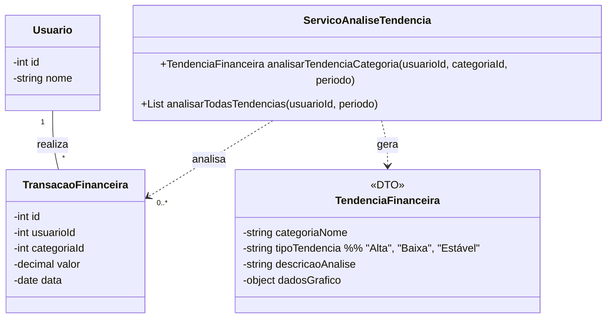

# Arquitetura da Solução — R13 Análise de Tendências

## 1. Introdução
Este documento detalha a arquitetura da solução para o requisito R13 - Análise de Tendências. O foco é a implementação de um serviço de backend capaz de analisar o histórico de transações financeiras do usuário para identificar padrões, como o aumento ou a diminuição de gastos em determinadas categorias ao longo do tempo.

## 2. Diagrama de Classes
O diagrama de classes a seguir detalha a arquitetura do serviço de análise. Ele não introduz novas entidades de dados persistentes, mas sim uma classe de serviço que processa dados existentes (`TransacoesFinanceiras`) para gerar um objeto de resultado (`TendenciaFinanceira`).




## 3. Modelos de Dados
### 3.1 Modelo Entidade Relacionamento (Conceitual)
**Entidades:**

- A funcionalidade de Análise de Tendências é um processo que opera sobre as entidades existentes, principalmente TransacaoFinanceira e Categoria. Ela não introduz novas entidades ao Modelo ER.

**Relacionamentos:**

- Não aplicável.

### 3.2 Projeto da Base de Dados (Esquema Lógico)
```SQL
-- Nenhuma tabela nova (CREATE TABLE) é necessária para esta funcionalidade.
-- A análise é calculada em tempo real a partir dos dados já existentes
-- na tabela TransacoesFinanceiras.
```

## 4. Implementação de Métodos
### 4.1 Lógica dos Métodos da Classe ServicoAnaliseTendencia
**analisarTendenciaCategoria(usuarioId, categoriaId, periodo)**

1. Recebe o usuarioId, categoriaId e um periodo (ex: "últimos 3 meses", "últimos 6 meses").

2. Consulta a tabela TransacoesFinanceiras no banco de dados, buscando todas as despesas do usuário para a categoria especificada no período definido.

3. Agrupa os gastos por mês.

4. Aplica um algoritmo de análise para identificar a tendência:

    - Compara o gasto do último mês com a média dos meses anteriores.

    - Se o aumento/diminuição for significativo (ex: > 10%), classifica a tendência como "Alta" ou "Baixa". Caso contrário, "Estável".

5. Gera uma descricaoAnalise em texto (ex: "Notamos uma tendência de alta nos seus gastos com 'Lazer'. Eles aumentaram 25% no último mês em comparação com a média anterior.").

6. Prepara os dadosGrafico (ex: uma série de valores mensais para plotar um gráfico de linhas no frontend).

7. Retorna um objeto TendenciaFinanceira com os resultados.

**analisarTodasTendencias(usuarioId, periodo)**

1. Executa um loop que chama analisarTendenciaCategoria para as principais categorias de despesa do usuário.

2. Coleta os resultados de cada análise.

3. Retorna uma lista de objetos TendenciaFinanceira para serem exibidos no dashboard ou em uma tela específica.