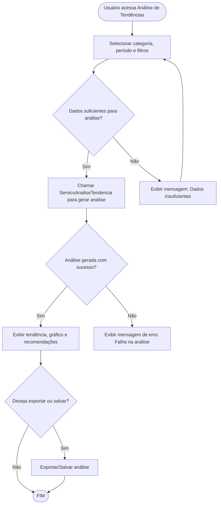

# Projeto de Interface — R13 Análise de Tendências

## 1. Modelos Funcionais

### 1.1 Diagrama de Fluxo (Fluxograma)

Este diagrama representa o fluxo de execução para a funcionalidade de análise de tendências financeiras, desde a solicitação do usuário até a exibição dos resultados e recomendações.

### 1.2 Telas Principais

#### Tela: Dashboard de Tendências

- **Componentes:**
  - Filtros de período (ex: últimos 3, 6, 12 meses)
  - Filtro de categoria (dropdown)
  - Botão "Analisar"
  - Lista de tendências por categoria (exibe tipo da tendência: Alta, Baixa, Estável)
  - Gráfico de linha com evolução dos gastos no período selecionado
  - Recomendações e descrição textual da análise
  - Botão "Exportar" (PDF/CSV)

#### Tela: Detalhe da Tendência

- **Componentes:**
  - Nome da categoria analisada
  - Gráfico detalhado dos valores mensais
  - Texto explicativo da tendência identificada
  - Recomendações personalizadas
  - Botão "Voltar" para o dashboard

### 1.3 Comportamento Esperado

- Ao acessar a Análise de Tendências, o usuário pode selecionar uma categoria e um período.
- O sistema exibe o resultado da análise, incluindo:
  - Tipo de tendência (Alta, Baixa, Estável)
  - Gráfico de evolução dos gastos
  - Recomendações e explicações em linguagem simples
- Caso não haja dados suficientes, uma mensagem informativa é exibida.
- O usuário pode exportar o resultado da análise.

## 2. Observações

- A interface deve ser responsiva e acessível.
- Os gráficos devem ser claros, com legendas e destaques para mudanças significativas.
- Recomendações devem ser objetivas e contextualizadas conforme o padrão identificado.
