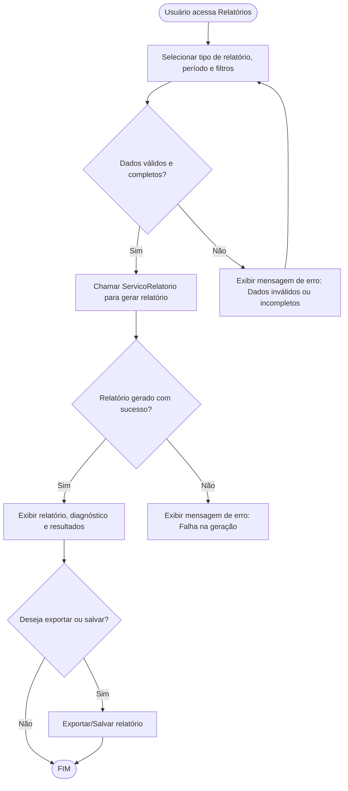

# Projeto de Interface — R4 Relatórios, Diagnósticos e Resultados

## 1. Modelos Funcionais

### 1.1 Diagrama de Fluxo (Fluxograma)

Este diagrama representa o fluxo de execução para a funcionalidade de geração de relatórios, diagnósticos e resultados, desde a solicitação do usuário até a exibição do relatório detalhado.

