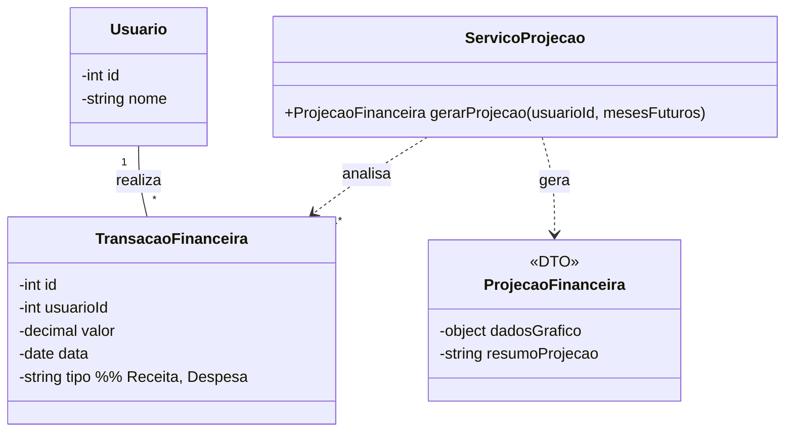

# Arquitetura da Solução — R14 Projeção Financeira

## 1. Introdução
Este documento detalha a arquitetura da solução para o requisito R14 - Projeção Financeira. O foco é a implementação de um serviço de backend que utiliza o histórico de transações do usuário para calcular e apresentar projeções de seus saldos e fluxo de caixa futuros.

## 2. Diagrama de Classes
O diagrama de classes a seguir detalha a arquitetura do serviço de projeção. Ele não introduz novas entidades de dados persistentes, mas sim uma classe de serviço que processa dados existentes (`TransacaoFinanceira`) para gerar um objeto de resultado (`ProjecaoFinanceira`).



## 3. Modelos de Dados
### 3.1 Modelo Entidade Relacionamento (Conceitual)
**Entidades:**
    - A funcionalidade de Projeção Financeira é um processo que opera sobre as entidades existentes, principalmente TransacaoFinanceira. Ela não introduz novas entidades ao Modelo ER.

**Relacionamentos:**

    - Não aplicável.

**3.2 Projeto da Base de Dados (Esquema Lógico)**
```
SQL
-- Nenhuma tabela nova (CREATE TABLE) é necessária para esta funcionalidade.
-- A projeção é calculada em tempo real a partir dos dados já existentes
-- na tabela TransacoesFinanceiras.
```

## 4. Implementação de Métodos
### 4.1 Lógica dos Métodos da Classe ProjecaoFinanceira
Esta classe é um DTO (Data Transfer Object), servindo como um contêiner para os dados da projeção que serão enviados ao frontend. Ela não possui lógica de negócio complexa.

### 4.2 Lógica dos Métodos do Serviço Projecao
**gerarProjecao(usuarioId, mesesFuturos)**

1. Recebe o usuarioId e o número de mesesFuturos para a projeção (ex: 6, 12).

2. Consulta a tabela TransacoesFinanceiras para obter um histórico de transações do usuário (ex: dos últimos 6 meses).

3. Calcula a média mensal de receitas e a média mensal de despesas com base no histórico.

4. A partir do saldo atual do usuário, inicia um loop para cada um dos mesesFuturos:

    - saldoProjetado_mes_N = saldoProjetado_mes_N-1 + mediaReceitas - mediaDespesas.

5. Coleta os valores de saldo projetado para cada mês.

6. Prepara o objeto ProjecaoFinanceira:

    - dadosGrafico: Uma série de pontos (mês, saldo projetado) para o frontend renderizar um gráfico de linhas.

    - resumoProjecao: Um texto explicativo (ex: "Com base na sua média de gastos e ganhos, seu saldo projetado para daqui a 6 meses é de R$ X.XXX,XX.").

7. Retorna o objeto ProjecaoFinanceira.