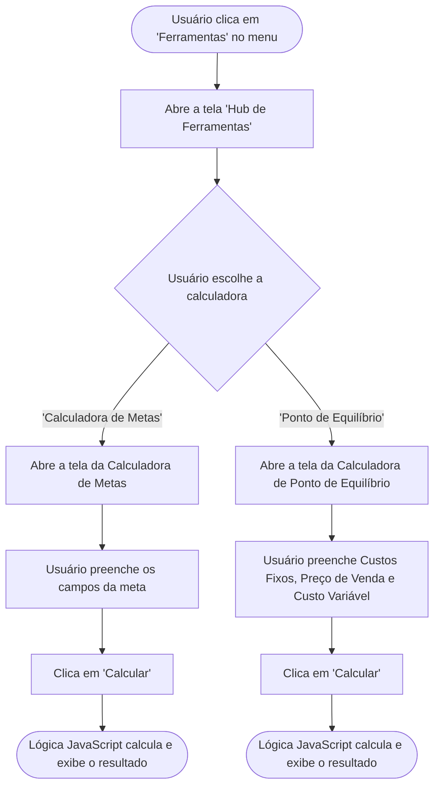

# Projeto de Interface — R15 Ferramentas Interativas

## 1. Modelos Funcionais

### 1.1 Diagrama de Fluxo (Fluxograma)

O diagrama a seguir representa a jornada do usuário para acessar o hub de ferramentas e utilizar as calculadoras. Conforme a decisão de arquitetura, ambas as ferramentas operam inteiramente no frontend (client-side), com os cálculos sendo executados em tempo real a partir dos dados inseridos manualmente pelo usuário.

