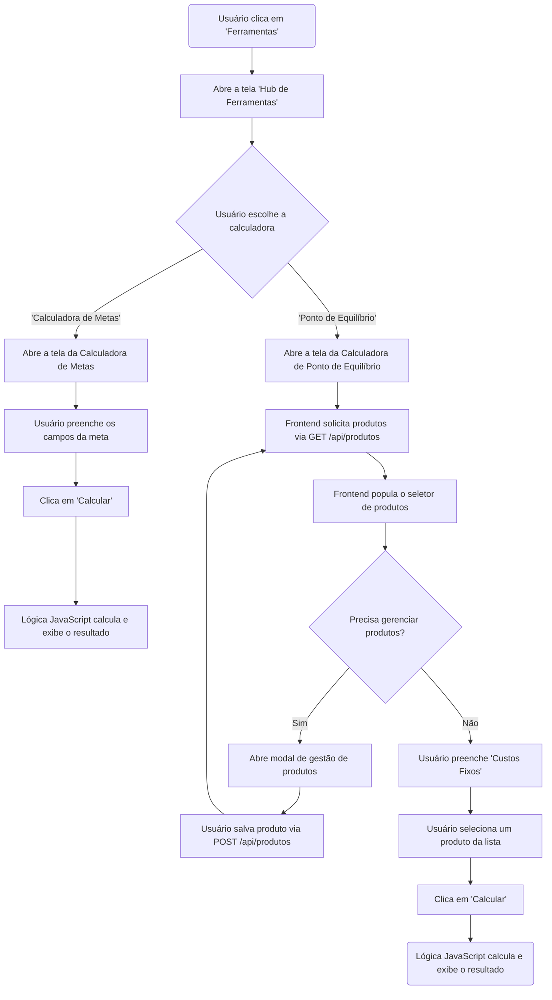

# Projeto de Interface — R15 Ferramentas Interativas

## 1. Modelos Funcionais

### 1.1 Diagrama de Fluxo (Fluxograma)

O diagrama a seguir representa a jornada do usuário para acessar o hub de ferramentas, escolher uma calculadora e interagir com e o fluxograma detalha os dois principais casos de uso do MVP: a "Calculadora de Metas" (com lógica no frontend) e a "Calculadora de Ponto de Equilíbrio", que requer comunicação com o backend para gerenciar uma lista de produtos cadastrados pelo usuário.

