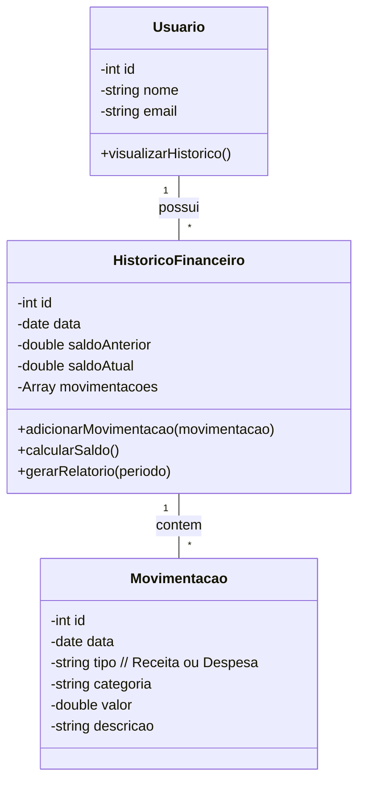

# Arquitetura da Solução — R16 Histórico Financeiro

## 1. Introdução

Este documento detalha a arquitetura da funcionalidade de histórico financeiro, permitindo ao usuário visualizar saldos e movimentações financeiras ao longo do tempo.

## 2. Diagrama de Classes



## 3. Modelos de Dados

### 3.1 Modelo Entidade Relacionamento (Conceitual)

**Entidades:**
- **Usuário:** `cod_usuario`, `nome`, `email`
- **HistoricoFinanceiro:** `cod_historico`, `data`, `saldo_anterior`, `saldo_atual`, `cod_usuario`
- **Movimentacao:** `cod_movimentacao`, `data`, `tipo`, `categoria`, `valor`, `descricao`, `cod_historico`

**Relacionamentos:**
- Usuário 1:N HistoricoFinanceiro
- HistoricoFinanceiro 1:N Movimentacao

### 3.2 Projeto da Base de Dados (Esquema Lógico)

```sql
CREATE TABLE Usuario (
    cod_usuario INT PRIMARY KEY AUTO_INCREMENT,
    nome VARCHAR(255) NOT NULL,
    email VARCHAR(255) NOT NULL
);

CREATE TABLE HistoricoFinanceiro (
    cod_historico INT PRIMARY KEY AUTO_INCREMENT,
    data DATE NOT NULL,
    saldo_anterior DECIMAL(12,2),
    saldo_atual DECIMAL(12,2),
    cod_usuario INT,
    FOREIGN KEY (cod_usuario) REFERENCES Usuario(cod_usuario)
);

CREATE TABLE Movimentacao (
    cod_movimentacao INT PRIMARY KEY AUTO_INCREMENT,
    data DATE NOT NULL,
    tipo ENUM('Receita', 'Despesa') NOT NULL,
    categoria VARCHAR(100),
    valor DECIMAL(12,2) NOT NULL,
    descricao TEXT,
    cod_historico INT,
    FOREIGN KEY (cod_historico) REFERENCES HistoricoFinanceiro(cod_historico)
);
```

## 4. Implementação de Métodos

### 4.1 Lógica dos Métodos da Classe HistoricoFinanceiro

**adicionarMovimentacao(movimentacao)**
- Adiciona uma nova movimentação ao histórico.
- Atualiza o saldo atual conforme o tipo (Receita soma, Despesa subtrai).

**calcularSaldo()**
- Calcula o saldo atual com base nas movimentações do período.

**gerarRelatorio(periodo)**
- Gera um relatório detalhado das movimentações e evolução do saldo para o período informado.

---
