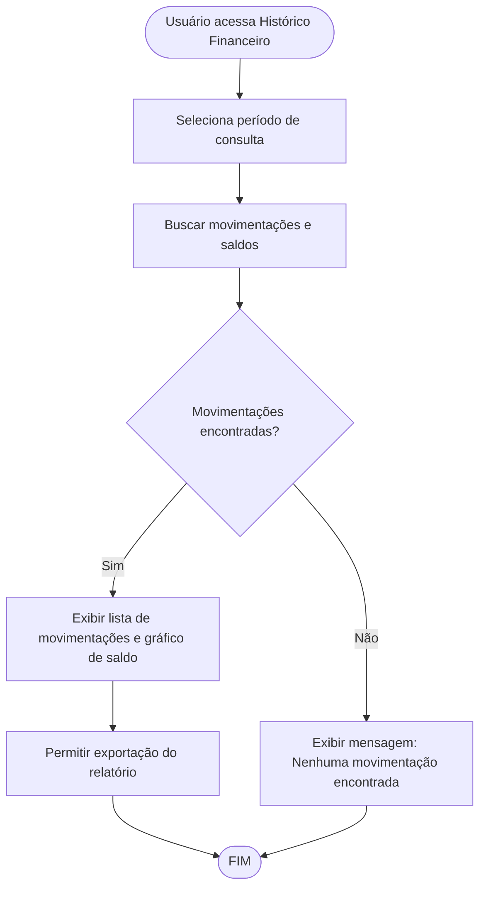

# Projeto de Interface — R16 Histórico Financeiro

## 1. Modelos Funcionais

### 1.1 Diagrama de Fluxo (Fluxograma)

Este diagrama representa o fluxo de visualização do histórico financeiro, desde a seleção do período até a exibição dos saldos e movimentações.

## 2. Protótipos de Telas

- Tela de seleção de período
- Lista de movimentações (com filtros por categoria, tipo, valor)
- Gráfico de evolução do saldo
- Botão para exportar relatório (PDF/Excel)

## 3. Requisitos de Interface

- Interface clara e intuitiva
- Gráficos responsivos
- Filtros avançados para busca de movimentações
- Opção de exportação de dados
