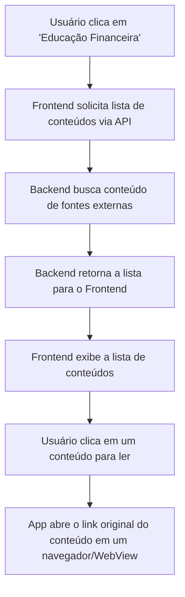

# Projeto de Interface — R2 Educação Financeira

## 1. Modelos Funcionais

### 1.1 Diagrama de Fluxo (Fluxograma)

O diagrama a seguir representa o fluxo de interação do usuário para acessar, interagir (curtir) e visualizar o conteúdo educativo, detalhando a comunicação com o backend para buscar artigos agregados e gerenciar os favoritos do usuário.

