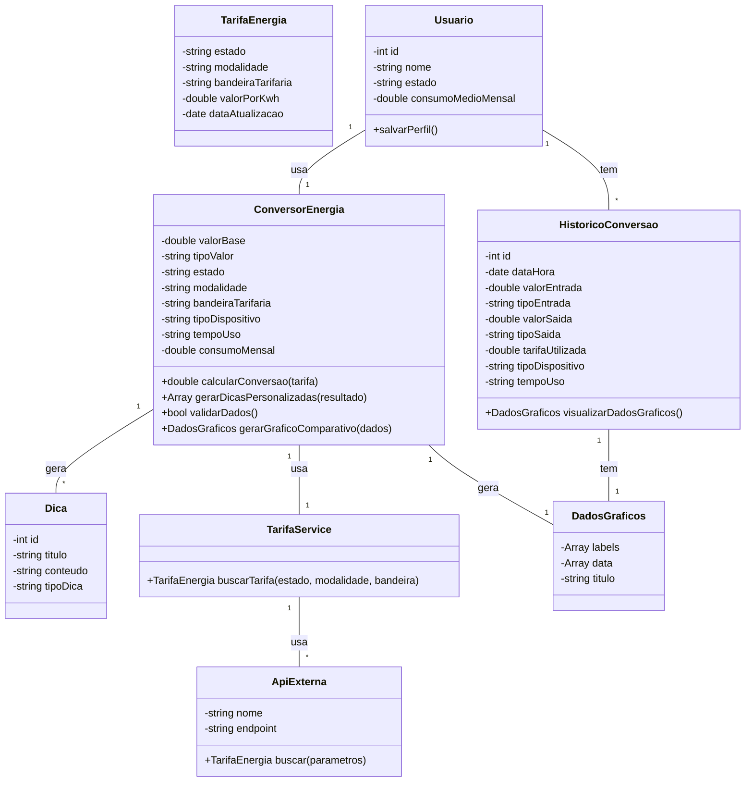

# Arquitetura da Solução — R3 Conversor de Energia

## 1. Introdução

Este documento detalha as melhorias nos artefatos de engenharia de software para o projeto Save Money, com foco na funcionalidade de conversão de energia.

## 2. Diagrama de Classes



## 3. Modelos de Dados

### 3.1 Modelo Entidade Relacionamento (Conceitual)

O modelo conceitual agora inclui a entidade API, que representa as fontes externas de dados de tarifas.

**Entidades:**

- **Usuário:** `cod_usuario`, `nome`, `estado`, `consumo_medio_mensal`
- **Conversao:** `cod_conversao`, `data_hora`, `valor_entrada`, `tipo_entrada`, `valor_saida`, `tipo_saida`, `tarifa_utilizada`, `tipo_dispositivo`, `tempo_uso`
- **Tarifa:** `cod_tarifa`, `estado`, `modalidade`, `bandeira_tarifaria`, `valor_por_kwh`, `data_atualizacao`
- **API:** `cod_api`, `nome_api`, `endpoint_api`, `token`
- **Dica:** `cod_dica`, `titulo`, `conteudo`, `tipo_dica`

**Relacionamentos:**

- Usuário 1:N Conversao
- Conversao N:1 Tarifa
- Tarifa N:1 API
- Conversao 1:N Dica

### 3.2 Projeto da Base de Dados (Esquema Lógico)

O esquema do banco de dados para suportar o armazenamento de dados.

```sql
-- Tabela para armazenar informações dos usuários
CREATE TABLE Usuario (
    cod_usuario INT PRIMARY KEY AUTO_INCREMENT,
    nome VARCHAR(255) NOT NULL,
    estado VARCHAR(50) NOT NULL,
    consumo_medio_mensal DECIMAL(10, 2)
);

-- Tabela para registrar as APIs externas de tarifa
CREATE TABLE ApiExterna (
    cod_api INT PRIMARY KEY AUTO_INCREMENT,
    nome_api VARCHAR(100) NOT NULL,
    endpoint_api VARCHAR(255) NOT NULL,
    token_api VARCHAR(255),
    UNIQUE (nome_api)
);

-- Tabela para armazenar as tarifas de energia
CREATE TABLE Tarifa_Conversao_Energia (
    cod_tarifa INT PRIMARY KEY AUTO_INCREMENT,
    cod_api INT,
    estado VARCHAR(50) NOT NULL,
    modalidade ENUM('Rede Convencional', 'Solar On-grid', 'Solar Off-grid', 'Outro') NOT NULL,
    bandeira_tarifaria ENUM('Verde', 'Amarela', 'Vermelha 1', 'Vermelha 2') NOT NULL,
    valor_por_kwh DECIMAL(8, 4) NOT NULL,
    data_atualizacao DATE NOT NULL,
    FOREIGN KEY (cod_api) REFERENCES ApiExterna(cod_api),
    UNIQUE (estado, modalidade, bandeira_tarifaria)
);

-- Tabela para armazenar o histórico de conversões
CREATE TABLE Historico_Conversao_Energia (
    cod_historico INT PRIMARY KEY AUTO_INCREMENT,
    cod_usuario INT,
    data_hora DATETIME NOT NULL,
    valor_entrada DECIMAL(10, 2) NOT NULL,
    tipo_entrada ENUM('kWh', 'R$') NOT NULL,
    valor_saida DECIMAL(10, 2) NOT NULL,
    tipo_saida ENUM('kWh', 'R$') NOT NULL,
    cod_tarifa DECIMAL(8, 4) NOT NULL,
    tipo_dispositivo VARCHAR(50),
    tempo_uso VARCHAR(50), -- Campo para armazenar a unidade de tempo ou uso (Ex: "por hora", "por km")
    dados_graficos_json JSON, -- Campo para armazenar dados de gráficos
    FOREIGN KEY (cod_usuario) REFERENCES Usuario(cod_usuario)
);

-- Tabela para armazenar as dicas de economia
CREATE TABLE Dica_Conversao_Energia (
    cod_dica INT PRIMARY KEY AUTO_INCREMENT,
    titulo VARCHAR(100) NOT NULL,
    conteudo TEXT NOT NULL,
    tipo_dica ENUM('Eficiencia', 'Energia Solar', 'Educacional', 'Veiculo Eletrico', 'Ar Condicionado') NOT NULL
);
```

## 4. Implementação de Métodos

### 4.1 Lógica dos Métodos da Classe ConversorEnergia

**validarDados()**

- Verifica se `valorBase` é um número válido e maior que zero.
- Verifica se `tipoValor` (kWh ou R$) foi selecionado.
- Verifica se `estado` foi selecionado.
- Verifica se `tipoDispositivo` foi selecionado.
- Nova Validação: Verifica se `tempoUso` foi selecionado, dependendo do `tipoDispositivo`.
- Retorna `true` se todos os dados são válidos, `false` caso contrário.

**calcularConversao()**

1. Obter a tarifa. O método chama o TarifaService para buscar a tarifa correspondente ao estado, modalidade e bandeira.
2. Ajustar o valor base. Se um `tempoUso` for especificado (ex: "dia", "mês", "km"), o `valorBase` é ajustado para a unidade de tempo padrão do cálculo (kWh). Por exemplo, se o usuário insere 10 kWh por hora e o tempo de uso é "dia", o valor base passa a ser 10 \* 24. Para "km", um valor de referência de consumo por km precisa ser usado para converter a distância em kWh.
3. Realizar o cálculo:
   - Se `tipoValor` for kWh, o cálculo é: `valorBase * tarifa`.
   - Se `tipoValor` for R$, o cálculo é: `valorBase / tarifa`.
4. Gerar e retornar o resultado. Retorna o valor convertido.

**gerarDicasPersonalizadas()**
O método avalia o resultado da conversão, o `consumoMensal` do usuário, o `tipoDispositivo` e agora o `tempoUso` para selecionar dicas relevantes.

Exemplo de regras:

- Se o `tipoDispositivo` for "Veículo Elétrico" e o `tempoUso` for "km", as dicas podem ser sobre a economia por quilômetro rodado e o impacto no custo total da energia.
- Se o `tipoDispositivo` for "Ar Condicionado" e o `tempoUso` for "horas de uso", as dicas podem incluir sugestões de temperatura ideal e a importância da manutenção para otimizar o consumo por hora.
- Se o consumo em kWh for alto (> 300 kWh/mês), sugere a instalação de energia solar.
- Se o consumo for baixo, sugere dicas de eficiência (troca de lâmpadas, aparelhos, etc.).
- Se a modalidade for "Rede Convencional", sugere a simulação de economia com energia solar.

**gerarGraficoComparativo()**
O método cria uma estrutura de dados para visualização.
Exemplo: Um gráfico de barras comparando o custo mensal do usuário com a rede convencional versus o custo estimado com energia solar (com base no payback e simulação financeira).
A estrutura de dados pode ser um array de objetos, como: `[ {label: 'Rede', value: 150}, {label: 'Solar', value: 30} ]`.

---
