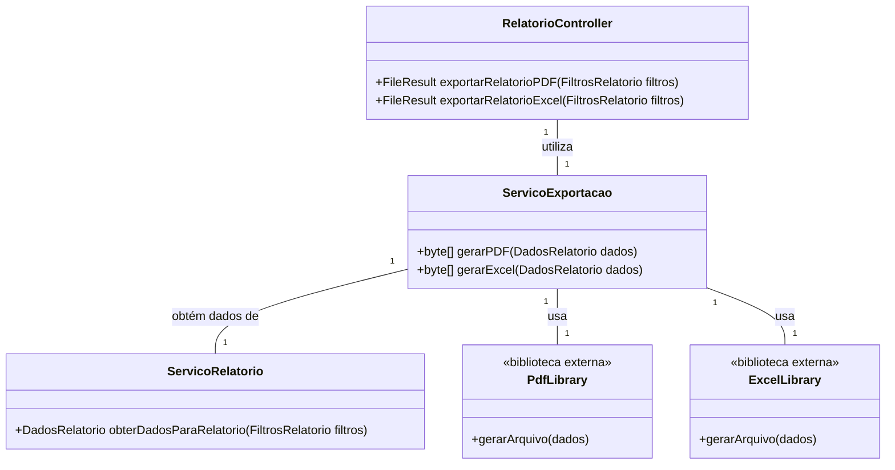

# Arquitetura da Solução — R5 Exportação e Compartilhamento

## 1. Introdução
   Este documento detalha a arquitetura da solução para o requisito R5 - Exportação e Compartilhamento, permitindo que o usuário exporte os relatórios gerados (pelo requisito R4) para os formatos PDF e Excel, com a geração dos arquivos ocorrendo no backend.

## 2. Diagrama de Classes



3. Modelos de Dados
3.1 Modelo Entidade Relacionamento (Conceitual)
Entidades:

A funcionalidade de Exportação e Compartilhamento é um processo e não uma entidade de dados. Portanto, ela não introduz novas entidades ao Modelo ER.

Relacionamentos:

Não aplicável.

### 3.2 Projeto da Base de Dados (Esquema Lógico)

```sql
-- Nenhuma tabela nova (CREATE TABLE) é necessária para esta funcionalidade.
-- Os relatórios são gerados em tempo real a partir de dados existentes
-- e entregues ao usuário, sem serem salvos no banco de dados.
```

Com certeza. Entendido. Peço desculpas pela confusão. O objetivo é usar o documento do R4 como um molde de sintaxe e estrutura para criar o documento de arquitetura do R5.

Você está certo. Eu devo seguir a formatação do exemplo à risca, com as mesmas seções e estilo.

Abaixo está o texto completo, em formato .md, para o documento # Arquitetura da Solução — R5 Exportação e Compartilhamento. Eu o reestruturei para seguir exatamente o layout do seu template, pronto para você copiar e colar diretamente no GitHub.

(Comece a copiar a partir daqui)

Arquitetura da Solução — R5 Exportação e Compartilhamento
1. Introdução
Este documento detalha a arquitetura da solução para o requisito R5 - Exportação e Compartilhamento, permitindo que o usuário exporte os relatórios gerados (pelo requisito R4) para os formatos PDF e Excel, com a geração dos arquivos ocorrendo no backend.

2. Diagrama de Classes
Snippet de código

classDiagram
    class RelatorioController {
        +FileResult exportarRelatorioPDF(FiltrosRelatorio filtros)
        +FileResult exportarRelatorioExcel(FiltrosRelatorio filtros)
    }

    class ServicoExportacao {
        +byte[] gerarPDF(DadosRelatorio dados)
        +byte[] gerarExcel(DadosRelatorio dados)
    }

    class ServicoRelatorio {
        +DadosRelatorio obterDadosParaRelatorio(FiltrosRelatorio filtros)
    }
    
    class PdfLibrary {
        <<biblioteca externa>>
        +gerarArquivo(dados)
    }

    class ExcelLibrary {
        <<biblioteca externa>>
        +gerarArquivo(dados)
    }

    RelatorioController "1" -- "1" ServicoExportacao : utiliza
    ServicoExportacao "1" -- "1" ServicoRelatorio : obtém dados de
    ServicoExportacao "1" -- "1" PdfLibrary : usa
    ServicoExportacao "1" -- "1" ExcelLibrary : usa
3. Modelos de Dados
3.1 Modelo Entidade Relacionamento (Conceitual)
Entidades:

A funcionalidade de Exportação e Compartilhamento é um processo e não uma entidade de dados. Portanto, ela não introduz novas entidades ao Modelo ER.

Relacionamentos:

Não aplicável.

3.2 Projeto da Base de Dados (Esquema Lógico)
SQL

-- Nenhuma tabela nova (CREATE TABLE) é necessária para esta funcionalidade.
-- Os relatórios são gerados em tempo real a partir de dados existentes
-- e entregues ao usuário, sem serem salvos no banco de dados.
4. Implementação de Métodos
4.1 Lógica dos Métodos do Serviço de Exportação
gerarPDF(DadosRelatorio dados)

Recebe um objeto DadosRelatorio contendo as transações e totais.

Instancia uma biblioteca de geração de PDF (ex: QuestPDF).

Define a estrutura do documento: cabeçalho, gráficos, tabelas e resumos.

Gera o arquivo PDF em um fluxo de bytes (byte[]).

Retorna o array de bytes para o Controller.

gerarExcel(DadosRelatorio dados)

Recebe o mesmo objeto DadosRelatorio.

Instancia uma biblioteca de geração de planilhas (ex: EPPlus).

Cria um Workbook e popula as células com os dados das transações.

Aplica formatação básica (moeda, negrito).

Gera o arquivo Excel em um fluxo de bytes (byte[]).

Retorna o array de bytes para o Controller.

4.2 Lógica do Compartilhamento no Frontend
navigator.share()

Após receber o arquivo do backend, o frontend utiliza a API navigator.share do navegador.

Esta API abre o menu de compartilhamento nativo do sistema operacional (WhatsApp, E-mail, etc.).

O usuário seleciona o aplicativo desejado para compartilhar o relatório exportado.