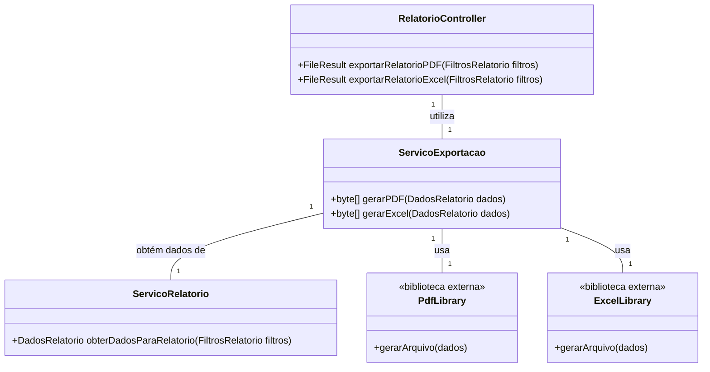

# Arquitetura da Solução — R5 Exportação e Compartilhamento

## 1. Introdução
Este documento detalha a arquitetura da solução para o requisito **R5 - Exportação e Compartilhamento**, permitindo que o usuário exporte os relatórios gerados (pelo requisito R4) para os formatos **PDF** e **Excel**, com a geração dos arquivos ocorrendo no backend.

---

## 2. Diagrama de Classes

## 3. Modelos de Dados
### 3.1 Modelo Entidade Relacionamento (Conceitual)

A funcionalidade de Exportação e Compartilhamento é um processo e não uma entidade de dados.
Portanto, ela não introduz novas entidades ao Modelo ER.
Como consequência, não há relacionamentos aplicáveis.

### 3.2 Projeto da Base de Dados (Esquema Lógico)
-- Nenhuma tabela nova (CREATE TABLE) é necessária para esta funcionalidade.
-- Os relatórios são gerados em tempo real a partir de dados existentes
-- e entregues ao usuário, sem serem salvos no banco de dados.

## 4. Implementação de Métodos
### 4.1 Lógica dos Métodos do Serviço de Exportação

**gerarPDF(DadosRelatorio dados)**

    - 1. Recebe um objeto DadosRelatorio contendo as transações e totais.

    - 2. Instancia uma biblioteca de geração de PDF (ex: QuestPDF).

    - 3 .Define a estrutura do documento: cabeçalho, gráficos, tabelas e resumos.

    - 4. Gera o arquivo PDF em um fluxo de bytes (byte[]).

    - 5. Retorna o array de bytes para o Controller.

**gerarExcel(DadosRelatorio dados)**

1. Recebe o mesmo objeto DadosRelatorio.

2. Instancia uma biblioteca de geração de planilhas (ex: EPPlus).

3. Cria um Workbook e popula as células com os dados das transações.

4. Aplica formatação básica (moeda, negrito).

5. Gera o arquivo Excel em um fluxo de bytes (byte[]).

6. Retorna o array de bytes para o Controller.

### 4.2 Lógica do Compartilhamento no Frontend

**navigator.share()**

1. Após receber o arquivo do backend, o frontend utiliza a API navigator.share do navegador.

2. Esta API abre o menu de compartilhamento nativo do sistema operacional (WhatsApp, E-mail, etc.).

3. O usuário seleciona o aplicativo desejado para compartilhar o relatório exportado.