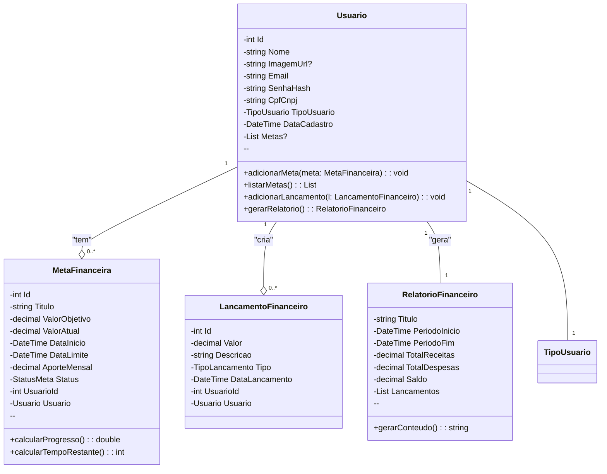

# Arquitetura da Solução — R6/R7 Pessoa Física/Jurífica

## 1. Introdução

Este documento detalha a arquitetura da solução para o projeto, com foco na entidade Usuário e suas principais relações com as metas financeiras. O objetivo é fornecer uma visão clara e técnica do modelo de dados e da lógica de negócios da aplicação, centrada no gerenciamento das finanças do usuário.

## 2. Diagrama de Classes



## 3. Modelos de Dados

### 3.1 Modelo Entidade Relacionamento (Conceitual)

O modelo conceitual descreve a entidade usuário.

**Entidades:**

- **Usuário:** `Entidade central que representa o indivíduo ou empresa que utiliza a aplicação.`

**Relacionamentos:**

- Usuário 1:N Conversao
- Usuário 1:N Metas Financeiras
- Usuário 1:N Gestão de Orçamento
- Usuário 1:N Projeção financeira
- Conversao 1:N Dica

### 3.2 Projeto da Base de Dados (Esquema Lógico)

O esquema do banco de dados para suportar o armazenamento de dados.

```sql
-- Tabela para armazenar informações dos usuários
CREATE TABLE Usuario (
	id_usuario INT PRIMARY KEY AUTO_INCREMENT,
	nome VARCHAR(255) NOT NULL,
	imagem_url VARCHAR(255),
	email VARCHAR(255) NOT NULL UNIQUE,
	senha_hash VARCHAR(255) NOT NULL,
	cpf_cnpj VARCHAR(14) NOT NULL UNIQUE,
	tipo_usuario ENUM('PESSOA_FISICA', 'PESSOA_JURIDICA') NOT NULL,
	data_cadastro DATETIME NOT NULL
);
```

## 4. Implementação de Métodos

### 4.1 Lógica dos Métodos da Classe ConversorEnergia

**adicionarMeta(meta: MetaFinanceira)**

- Este método permite que o usuário crie uma nova meta financeira. A lógica valida a meta recebida, a associa ao id_usuario e a persiste no banco de dados na tabela MetaFinanceira.

**listarMetas(): List<MetaFinanceira>**

- O método busca no banco de dados todas as metas associadas ao id_usuario atual e as retorna em uma lista para exibição na interface do usuário.

**adicionarLancamento(l: LancamentoFinanceiro)**
- Esta função registra uma nova transação financeira, seja uma receita ou despesa. Ela associa o lançamento ao id_usuario e o insere na tabela LancamentoFinanceiro.

**gerarRelatorio(): RelatorioFinanceiro**
- O método consolida todas as transações de um determinado período para o usuário. Ele calcula o total de receitas, despesas e o saldo final, retornando um objeto RelatorioFinanceiro para visualização e análise.

---
