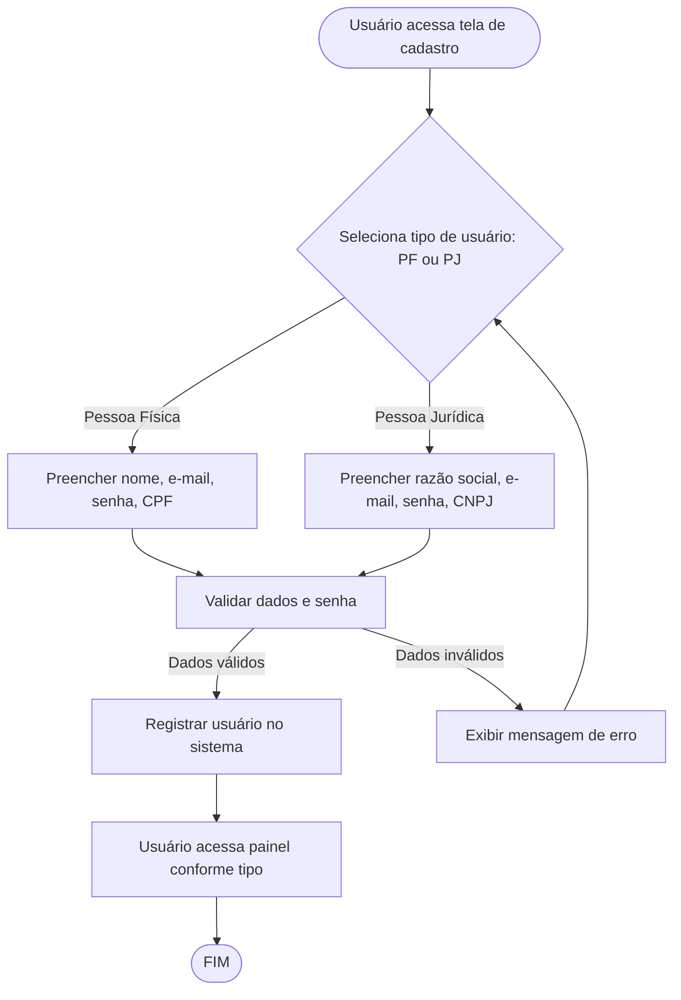

# Projeto de Interface — R6/R7 Pessoa Física/Jurídica

## 1. Modelos Funcionais

### 1.1 Diagrama de Fluxo (Fluxograma)

Este diagrama representa o fluxo de cadastro e uso do sistema por usuários Pessoa Física e Pessoa Jurídica, desde a entrada dos dados até a diferenciação de funcionalidades.

## 2. Protótipos de Telas

- Tela de Cadastro: Seleção de tipo (PF/PJ), campos dinâmicos para CPF ou CNPJ, nome ou razão social, e-mail, senha.
- Tela de Login: E-mail e senha.
- Tela de Perfil: Exibe dados do usuário, tipo de conta, opção de editar informações.
- Painel Pessoa Física: Funcionalidades voltadas para controle financeiro pessoal, metas, histórico.
- Painel Pessoa Jurídica: Funcionalidades para gestão financeira empresarial, relatórios, fluxo de caixa.

## 3. Navegação

- O usuário pode alternar entre cadastro e login.
- Após cadastro/login, é direcionado ao painel correspondente ao tipo de usuário.
- Opção de editar perfil e trocar tipo de conta (se permitido).
- Funcionalidades e menus adaptados conforme PF ou PJ.
