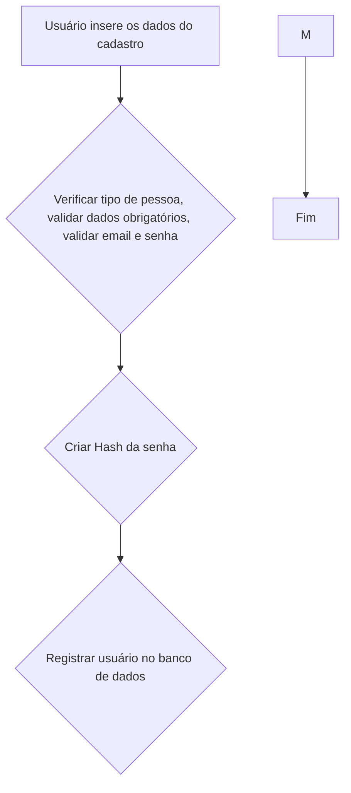

# Projeto de Interface — R3 Conversor de Energia

## 1. Modelos Funcionais

### 1.1 Diagrama de Fluxo (Fluxograma)

Este diagrama representa o fluxo de execução para a funcionalidade de conversão de energia, desde a entrada de dados do usuário até a exibição do resultado e das dicas.

