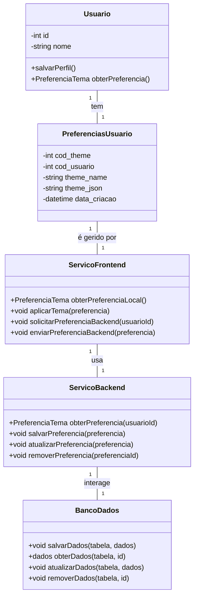

# Arquitetura da Solução — R8 Personalização do Tema

## 1. Introdução

Este documento detalha os artefatos de engenharia de software para o requisito de personalização do tema, permitindo que o usuário customize a aparência da aplicação, com foco em sua implementação completa, incluindo backend e persistência.

## 2. Diagrama de Classes

O diagrama de classes detalha a arquitetura da funcionalidade de personalização de tema, incluindo os principais atributos, métodos e relacionamentos entre frontend, backend e persistência.




## 3. Modelos de Dados

### 3.1 Modelo Entidade Relacionamento (Conceitual)

**Entidades:**

- **Usuário**: Entidade principal que se relaciona com as preferências.
- **UserPreference**: Representa as escolhas de tema de um usuário.

**Atributos de UserPreference:**

- cod_theme
- cod_usuario
- theme_name
- theme_json (JSON)
- data_criacao

**Relacionamentos:**

- Usuário – UserPreference: Um usuário tem uma e apenas uma preferência de tema.
- Cardinalidade: 1:1

### 3.2 Projeto da Base de Dados (Esquema Lógico)

```sql
CREATE TABLE PreferenciasUsuario (
    cod_theme INT PRIMARY KEY IDENTITY,
    cod_usuario INT NOT NULL,
    theme_name NVARCHAR(50),
    theme JSON,
    data_criacao DATETIME DEFAULT GETDATE(),
    FOREIGN KEY (cod_usuario) REFERENCES Users(Id)
);
```


## 4. Implementação de Métodos

### 4.1 Lógica dos Métodos da Classe PreferenciaTema

**validarDados()**

- Verifica se `tema` é uma string válida e está entre as opções permitidas ("Claro", "Escuro", "Custom").
- Verifica se `esquemaCores`, `corPrimaria`, `corSecundaria` estão preenchidos.
- Verifica se o JSON de cores está bem formado.
- Verifica se campos opcionais (tipografia, espaçamento, bordas, sombras) estão corretos se fornecidos.
- Retorna `true` se todos os dados são válidos, `false` caso contrário.

### 4.2 Lógica dos Métodos do Serviço de Frontend

**aplicarTema()**
1. Recebe uma instância de PreferenciaTema.
2. Aplica as configurações de tema na interface do usuário (cores, tipografia, layout, etc).
3. Atualiza variáveis CSS ou propriedades globais do framework.
4. Retorna confirmação de aplicação.

**obterPreferenciaLocal()**
1. Busca a preferência de tema salva localmente (ex: localStorage ou cookies).
2. Se não existir, retorna preferência padrão (ex: tema "Claro").

**solicitarPreferenciaBackend()**
1. Realiza requisição à API do backend para obter a preferência do usuário.
2. Se não houver preferência salva, retorna padrão.

**enviarPreferenciaBackend()**
1. Envia a preferência atualizada para o backend persistir.
2. Aguarda confirmação de sucesso.

### 4.3 Lógica dos Métodos do Serviço de Backend

**obterPreferencia()**
1. Consulta o banco de dados pela preferência do usuário.
2. Se não existir, retorna preferência padrão.

**salvarPreferencia()**
1. Valida os dados recebidos.
2. Insere nova preferência no banco de dados.

**atualizarPreferencia()**
1. Valida os dados recebidos.
2. Atualiza a preferência existente no banco de dados.

**removerPreferencia()**
1. Remove a preferência do banco de dados pelo id.

### 4.4 Lógica dos Métodos da Classe BancoDados

**salvarDados()**
- Insere dados na tabela especificada.

**obterDados()**
- Busca dados pelo id na tabela especificada.

**atualizarDados()**
- Atualiza dados na tabela especificada.

**removerDados()**
- Remove dados pelo id na tabela especificada.

---