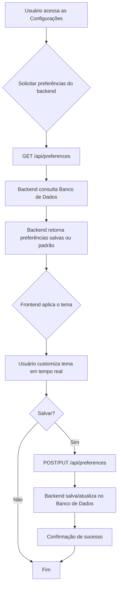

# Projeto de Interface — R8 Personalização do Tema

## 1. Modelos Funcionais

### 1.1 Diagrama de Fluxo (Fluxograma)

O diagrama a seguir representa o fluxo de interação do usuário para personalizar e salvar o tema, detalhando a comunicação com o backend e a persistência.

---
