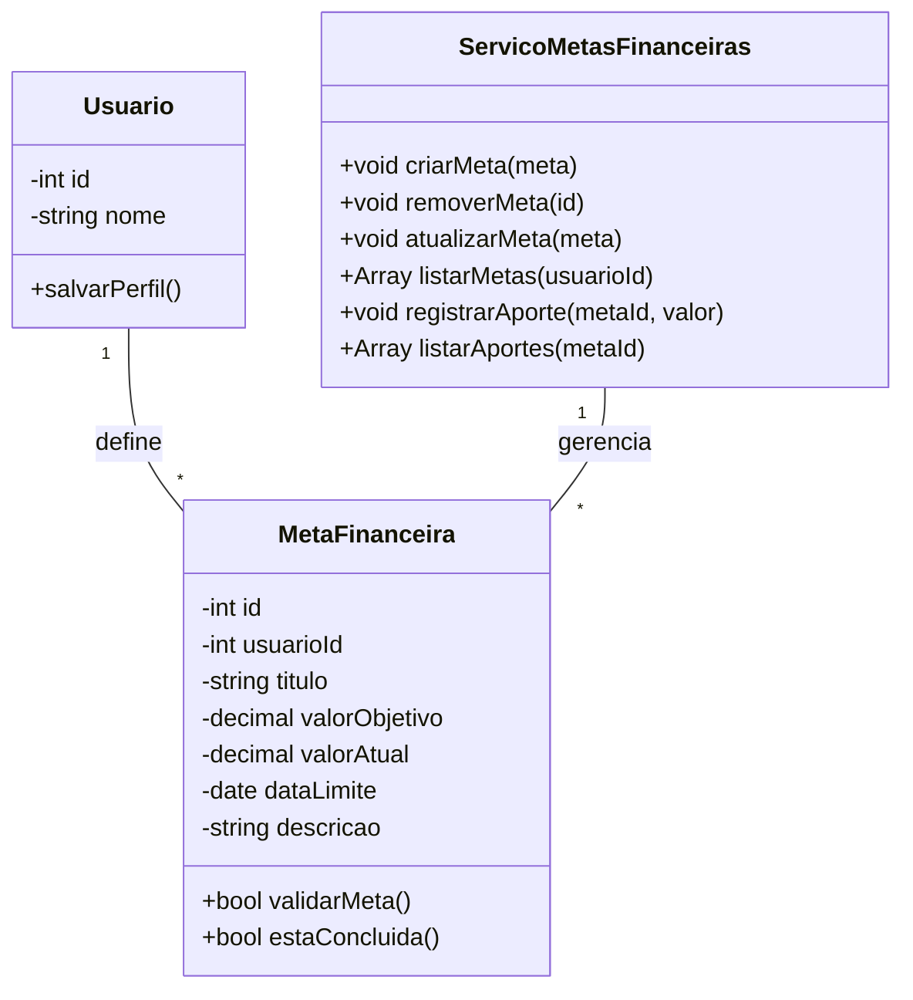

# Arquitetura da Solução — R9 Metas Financeiras

## 1. Introdução

Este documento detalha a arquitetura da solução para o requisito R9 - Metas Financeiras, permitindo que o usuário crie, acompanhe e gerencie metas financeiras, com foco em sua implementação completa, incluindo backend, persistência e regras de negócio.

## 2. Diagrama de Classes



## 3. Modelos de Dados

### 3.1 Modelo Entidade Relacionamento (Conceitual)

**Entidades:**

- **Usuário:** `cod_usuario`, `nome`
- **MetaFinanceira:** `cod_meta`, `cod_usuario`, `titulo`, `valor_objetivo`, `valor_atual`, `data_limite`, `descricao`
- **Aporte:** `cod_aporte`, `cod_meta`, `valor`, `data_aporte`

**Relacionamentos:**

- Usuário 1:N MetaFinanceira
- MetaFinanceira 1:N Aporte

### 3.2 Projeto da Base de Dados (Esquema Lógico)

```sql
-- Tabela para armazenar informações dos usuários
CREATE TABLE Usuario (
    cod_usuario INT PRIMARY KEY AUTO_INCREMENT,
    nome VARCHAR(255) NOT NULL
);

-- Tabela para armazenar metas financeiras
CREATE TABLE MetaFinanceira (
    cod_meta INT PRIMARY KEY AUTO_INCREMENT,
    cod_usuario INT NOT NULL,
    titulo VARCHAR(255) NOT NULL,
    valor_objetivo DECIMAL(12, 2) NOT NULL,
    valor_atual DECIMAL(12, 2) DEFAULT 0,
    data_limite DATE,
    descricao TEXT,
    FOREIGN KEY (cod_usuario) REFERENCES Usuario(cod_usuario)
);

-- Tabela para registrar aportes em metas
CREATE TABLE Aporte (
    cod_aporte INT PRIMARY KEY AUTO_INCREMENT,
    cod_meta INT NOT NULL,
    valor DECIMAL(12, 2) NOT NULL,
    data_aporte DATE NOT NULL,
    FOREIGN KEY (cod_meta) REFERENCES MetaFinanceira(cod_meta)
);
```

## 4. Implementação de Métodos

### 4.1 Lógica dos Métodos da Classe MetaFinanceira

**validarMeta()**
- Verifica se `valor_objetivo` é um número válido e maior que zero.
- Verifica se `titulo` está preenchido.
- Verifica se `data_limite` (se informada) é uma data futura.
- Retorna `true` se todos os dados são válidos, `false` caso contrário.

**estaConcluida()**
- Retorna `true` se `valor_atual` >= `valor_objetivo`.

### 4.2 Lógica dos Métodos do Serviço de Metas Financeiras

**criarMeta()**
1. Recebe uma instância de MetaFinanceira.
2. Valida os dados.
3. Insere a meta no banco de dados.
4. Retorna confirmação de inclusão.

**removerMeta()**
1. Remove a meta do banco de dados pelo id.
2. Remove os aportes associados.

**atualizarMeta()**
1. Valida os dados recebidos.
2. Atualiza a meta existente no banco de dados.

**listarMetas()**
1. Busca todas as metas financeiras do usuário.
2. Retorna a lista de metas.

**registrarAporte()**
1. Recebe o id da meta e o valor do aporte.
2. Valida o valor do aporte (>0).
3. Insere o aporte na tabela de aportes.
4. Atualiza o valor_atual da meta.

**listarAportes()**
1. Busca todos os aportes de uma meta.
2. Retorna a lista de aportes.

