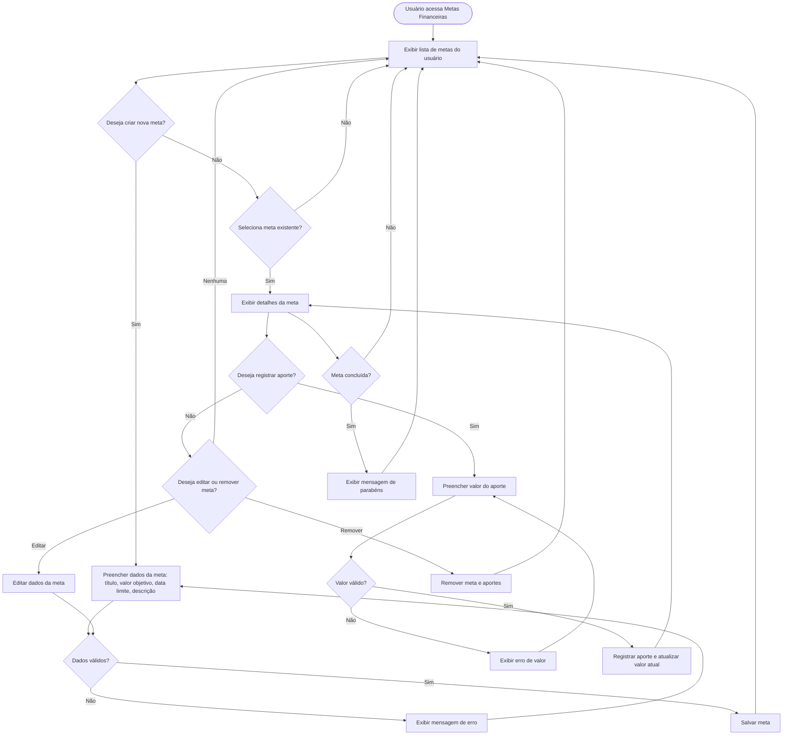

# Projeto de Interface — R9 Metas Financeiras

## 1. Modelos Funcionais

### 1.1 Diagrama de Fluxo (Fluxograma)

Este diagrama representa o fluxo de execução para a funcionalidade de metas financeiras, desde a criação da meta até o acompanhamento e conclusão.

### 1.2 Protótipos de Telas (Sugestão)

- **Tela de Listagem de Metas:**

  - Lista todas as metas do usuário, mostrando título, valor objetivo, valor atual, progresso (%) e status (em andamento/concluída).
  - Botão para criar nova meta.
  - Ações: visualizar detalhes, editar, remover.

- **Tela de Detalhes da Meta:**

  - Exibe informações completas da meta.
  - Lista de aportes realizados (data, valor).
  - Campo para registrar novo aporte.
  - Indicador visual de progresso (barra ou círculo).
  - Botão para editar/remover meta.

- **Tela de Criação/Edição de Meta:**

  - Formulário para inserir/editar título, valor objetivo, data limite, descrição.
  - Validação de campos obrigatórios.

- **Feedback Visual:**
  - Mensagens de sucesso, erro e conclusão de meta.
  - Indicadores de progresso e status.
